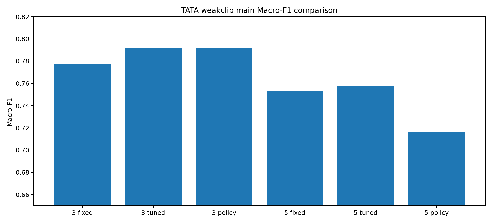
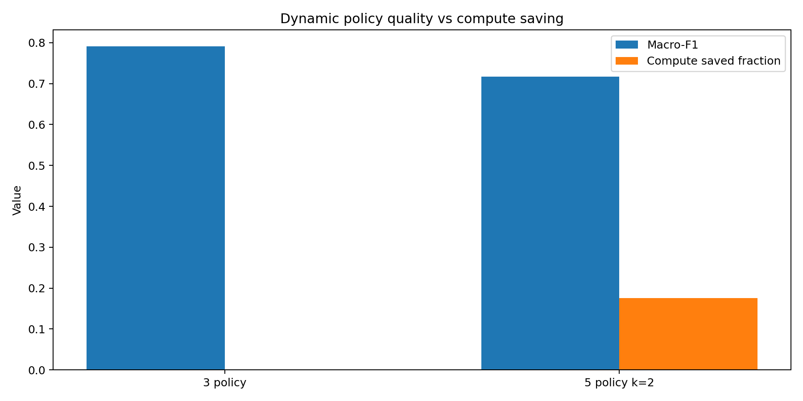
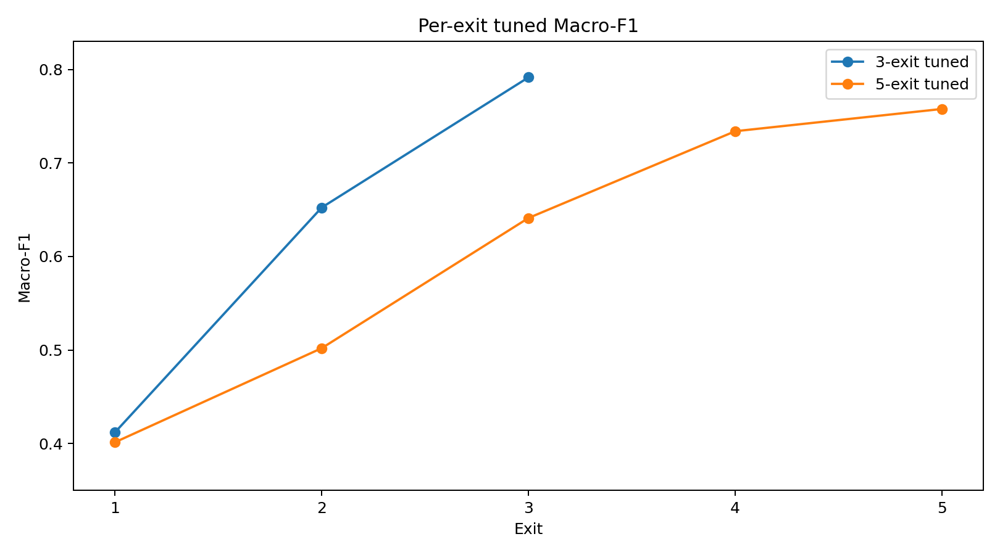
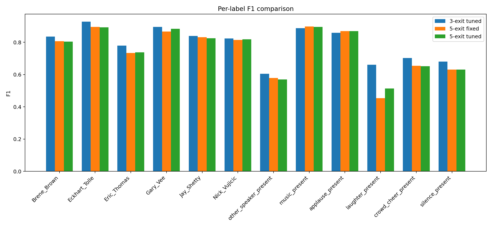

# NeuroAccuExit-ASHADIP — TinyAudioTriageAgent v0.5_tata_2

This README documents the active **`agentic_data_preprocessing_v0.5_tata_2`** branch. It extends the stable v0.4 human-talk findings into a practical TinyAudioTriageAgent experiment using true multi-label BCE/sigmoid supervision.

```text
Branch: agentic_data_preprocessing_v0.5_tata_2
Agenda: TinyAudioTriageAgent weak clip-level multi-label preprocessing for human-talk audio
Dataset stage: reviewed 5-sec clip manifest -> weak inherited 1-sec segment manifest -> log-mel features
Task: multi-label detection of target speaker identity, non-target speech, and event/background audio
Models completed: TATA 3-exit and TATA 5-exit weakclip variants
Labels: 12 = 6 target speakers + other_speaker_present + 5 event/background labels
Current status: 3-exit fixed/tuned/policy and 5-exit fixed/tuned/policy completed
Best current quality result: 3-exit tuned threshold, Macro-F1 = 0.7916
```

## Branch agenda

This branch builds the first practical **TinyAudioTriageAgent (TATA)** for human-talk preprocessing. TATA is not designed to replace the v0.4 softmax speaker classifier directly. Instead, it detects which audio-content labels are present so that raw clips can later be routed into `accepted`, `accepted_with_warning`, `needs_review`, or `rejected` groups.

The completed v0.5_tata_2 pipeline is:

```text
manual 5-sec clip-level multi-label manifest
  -> training-ready reviewed CSV
  -> weak inherited 1-sec segment manifest
  -> log-mel features
  -> TATA 3-exit and 5-exit BCE/sigmoid training
  -> threshold tuning
  -> multi-label greedy dynamic policy analysis
```

## Research questions

| ID | Research question | Answer after 3-exit and 5-exit experiments |
| --- | --- | --- |
| RQ1 | Can reviewed 5-sec clip-level labels support a first TATA model? | Yes. 2,074 parent clips produced 12,469 weak 1-sec segments with 0 segment-build errors. |
| RQ2 | Did we protect against parent-clip leakage? | Yes. Segments inherit split from parent clip; no parent clip was split across train/val/test. |
| RQ3 | Can 3-exit TATA learn the 12-label task? | Yes. Fixed Macro-F1 = 0.7774; tuned Macro-F1 = 0.7916. |
| RQ4 | Does threshold tuning help 3-exit TATA? | Yes. Macro-F1 improved by +0.0142 and hamming loss improved slightly. |
| RQ5 | Does 5-exit improve final quality? | No. 5-exit tuned Macro-F1 = 0.7578, below 3-exit tuned = 0.7916. |
| RQ6 | Does 5-exit improve early-exit efficiency? | Partly. 5-exit policy saves 17.60% compute at stable_k=2, but Macro-F1 drops to 0.7166. |
| RQ7 | What is the best current TATA configuration? | 3-exit tuned threshold, used as final-exit triage detector rather than early-exit detector. |
| RQ8 | What should come next? | Document/push this checkpoint, then move toward synthetic mixed examples, stronger label balancing/calibration, and later raw-data pseudo-label routing. |

## TATA label schema

| Group | Labels |
|---|---|
| Target speaker identity | `Brene_Brown`, `Eckhart_Tolle`, `Eric_Thomas`, `Gary_Vee`, `Jay_Shetty`, `Nick_Vujicic` |
| Non-target speech | `other_speaker_present` |
| Event/background | `music_present`, `applause_present`, `laughter_present`, `crowd_cheer_present`, `silence_present` |

## Dataset and manifest status

| Item | Value |
|---|---:|
| Reviewed parent clips before training filter | 2,085 |
| Excluded/blocked/holdout rows | 11 |
| Training-ready parent clips | 2,074 |
| Weak 1-sec segments | 12,469 |
| Segment build errors | 0 |
| Parent-clip leakage | 0 |
| Labels | 12 |

## Main comparison

| Result | Macro-F1 | Micro-F1 | Samples-F1 | Exact match | Hamming loss | Avg pred labels | Avg exit depth | Compute saved |
| --- | --- | --- | --- | --- | --- | --- | --- | --- |
| 3-exit fixed threshold | 0.7774 | 0.7656 | 0.7503 | 0.4895 | 0.0616 | 1.5650 | 3.0000 | 0.00% |
| 3-exit tuned threshold | 0.7916 | 0.7796 | 0.7619 | 0.4732 | 0.0607 | 1.7175 | 3.0000 | 0.00% |
| 3-exit dynamic policy | 0.7916 | 0.7796 | 0.7619 | 0.4732 | 0.0607 | 1.7175 | 3.0000 | 0.00% |
| 5-exit fixed threshold | 0.7529 | 0.7665 | 0.7242 | 0.5013 | 0.0574 | 1.3641 | 5.0000 | 0.00% |
| 5-exit tuned threshold | 0.7578 | 0.7503 | 0.7287 | 0.4314 | 0.0693 | 1.7420 | 5.0000 | 0.00% |
| 5-exit dynamic policy | 0.7166 | 0.7081 | 0.6848 | 0.3376 | 0.0847 | 1.8970 | 4.1198 | 17.60% |

## Per-exit quality

| Exit | 3-exit fixed Macro-F1 | 3-exit tuned Macro-F1 | 5-exit fixed Macro-F1 | 5-exit tuned Macro-F1 |
| --- | --- | --- | --- | --- |
| 1 | 0.1730 | 0.4120 | 0.1621 | 0.4014 |
| 2 | 0.5468 | 0.6524 | 0.2565 | 0.5020 |
| 3 | 0.7774 | 0.7916 | 0.4807 | 0.6412 |
| 4 | N/A | N/A | 0.6886 | 0.7340 |
| 5 | N/A | N/A | 0.7529 | 0.7578 |

## Dynamic policy sweep

| Model | Stable K | Macro-F1 | Micro-F1 | Exact match | Hamming loss | Avg exit depth | Compute saved |
| --- | --- | --- | --- | --- | --- | --- | --- |
| 3-exit | 1 | 0.6622 | 0.6574 | 0.2677 | 0.0995 | 2.0367 | 32.11% |
| 3-exit | 2 | 0.7916 | 0.7796 | 0.4732 | 0.0607 | 3.0000 | 0.00% |
| 3-exit | 3 | 0.7916 | 0.7796 | 0.4732 | 0.0607 | 3.0000 | 0.00% |
| 5-exit | 1 | 0.5034 | 0.5286 | 0.0811 | 0.1638 | 2.0076 | 59.85% |
| 5-exit | 2 | 0.7166 | 0.7081 | 0.3376 | 0.0847 | 4.1198 | 17.60% |
| 5-exit | 3 | 0.7569 | 0.7476 | 0.4227 | 0.0703 | 4.8899 | 2.20% |

## Per-label F1 comparison

| Label | 3 fixed F1 | 3 tuned F1 | 5 tuned F1 | Δ 3 tuned-fixed | Δ 5 tuned-fixed | 3 tuned thr | 5 tuned thr |
| --- | --- | --- | --- | --- | --- | --- | --- |
| Brene_Brown | 0.8213 | 0.8351 | 0.8043 | 0.0138 | -0.0027 | 0.8500 | 0.5800 |
| Eckhart_Tolle | 0.9219 | 0.9283 | 0.8930 | 0.0064 | -0.0031 | 0.6400 | 0.7100 |
| Eric_Thomas | 0.7359 | 0.7798 | 0.7385 | 0.0439 | 0.0041 | 0.2000 | 0.4500 |
| Gary_Vee | 0.8746 | 0.8958 | 0.8835 | 0.0211 | 0.0172 | 0.4100 | 0.2900 |
| Jay_Shetty | 0.8521 | 0.8394 | 0.8250 | -0.0128 | -0.0064 | 0.2700 | 0.3200 |
| Nick_Vujicic | 0.8099 | 0.8235 | 0.8188 | 0.0137 | 0.0045 | 0.4400 | 0.3300 |
| other_speaker_present | 0.6195 | 0.6056 | 0.5701 | -0.0139 | -0.0093 | 0.4000 | 0.2500 |
| music_present | 0.8383 | 0.8880 | 0.8957 | 0.0497 | -0.0028 | 0.1500 | 0.4900 |
| applause_present | 0.8587 | 0.8587 | 0.8690 | 0.0000 | 0.0000 | 0.5000 | 0.5000 |
| laughter_present | 0.6306 | 0.6606 | 0.5135 | 0.0300 | 0.0597 | 0.7200 | 0.2900 |
| crowd_cheer_present | 0.6872 | 0.7028 | 0.6517 | 0.0156 | -0.0023 | 0.3500 | 0.3500 |
| silence_present | 0.6783 | 0.6812 | 0.6306 | 0.0029 | 0.0000 | 0.3000 | 0.4700 |

## 5-exit fixed vs tuned per-label analysis

| Label | 5 fixed F1 | 5 tuned F1 | ΔF1 | Fixed P | Tuned P | Fixed R | Tuned R |
| --- | --- | --- | --- | --- | --- | --- | --- |
| Brene_Brown | 0.8070 | 0.8043 | -0.0027 | 0.8519 | 0.8810 | 0.7667 | 0.7400 |
| Eckhart_Tolle | 0.8961 | 0.8930 | -0.0031 | 0.8681 | 0.8897 | 0.9259 | 0.8963 |
| Eric_Thomas | 0.7344 | 0.7385 | 0.0041 | 0.7769 | 0.7680 | 0.6963 | 0.7111 |
| Gary_Vee | 0.8663 | 0.8835 | 0.0172 | 0.9675 | 0.9106 | 0.7842 | 0.8579 |
| Jay_Shetty | 0.8314 | 0.8250 | -0.0064 | 0.8480 | 0.7508 | 0.8154 | 0.9154 |
| Nick_Vujicic | 0.8143 | 0.8188 | 0.0045 | 0.8769 | 0.8243 | 0.7600 | 0.8133 |
| other_speaker_present | 0.5794 | 0.5701 | -0.0093 | 0.7102 | 0.4735 | 0.4892 | 0.7162 |
| music_present | 0.8985 | 0.8957 | -0.0028 | 0.9474 | 0.9392 | 0.8544 | 0.8560 |
| applause_present | 0.8690 | 0.8690 | 0.0000 | 0.9238 | 0.9238 | 0.8203 | 0.8203 |
| laughter_present | 0.4538 | 0.5135 | 0.0597 | 0.7105 | 0.5167 | 0.3333 | 0.5103 |
| crowd_cheer_present | 0.6539 | 0.6517 | -0.0023 | 0.5820 | 0.5242 | 0.7460 | 0.8611 |
| silence_present | 0.6306 | 0.6306 | 0.0000 | 0.8537 | 0.8537 | 0.5000 | 0.5000 |

## Best result by goal

| Goal | Best current result | Evidence |
| --- | --- | --- |
| Best overall Macro-F1 | 3-exit tuned threshold | Macro-F1 0.7916; Micro-F1 0.7796 |
| Best exact match | 5-exit fixed threshold | Exact match 0.5013 |
| Best hamming loss | 5-exit fixed threshold | Hamming loss 0.0574 |
| Best dynamic compute saving with usable quality | 5-exit stable_k=2 policy | 17.60% saved but Macro-F1 only 0.7166 |
| Most reliable current TATA configuration | 3-exit tuned threshold | Best F1 quality; should be used as final-exit triage detector, not early-exit policy yet |


## Figures

Generated comparison figures are saved under `docs/figures/human_talk/agentic_data_preprocessing_v0.5_tata_2/`.










## Current research conclusion

The 3-exit tuned-threshold TATA model is the best current configuration for overall multi-label triage quality. It achieves the strongest Macro-F1, Micro-F1, and Samples-F1 among the evaluated TATA variants. The 5-exit model provides more intermediate decision points and achieves limited compute saving under dynamic policy, but it does not improve final detection quality and its dynamic policy loses too much F1. Therefore, the current branch supports TATA primarily as a **final-exit audio triage detector**, not yet as a reliable early-exit detector.

Paper-safe statement:

```text
The v0.5_tata_2 experiments show that a weakly supervised TinyAudioTriageAgent can learn a 12-label human-talk triage task from reviewed clip-level annotations. Per-label threshold tuning improves the 3-exit model from 0.7774 to 0.7916 Macro-F1. Adding more exits does not automatically improve final quality: the 5-exit model enables limited compute saving, but at a substantial quality cost. The best current configuration is therefore the 3-exit tuned-threshold TATA model, while future work should improve segment-level supervision through synthetic mixtures, label balancing, and calibration before relying on early exits.
```


## Next strategy

1. Commit and push the current v0.5_tata_2 code/docs checkpoint.
2. Keep **3-exit tuned threshold** as the current best TATA quality baseline.
3. Do not rely on TATA early exits yet.
4. Next research stage should focus on synthetic mixed multi-label examples, label balancing/positive weighting, calibration, and then raw-dataset pseudo-label routing.
