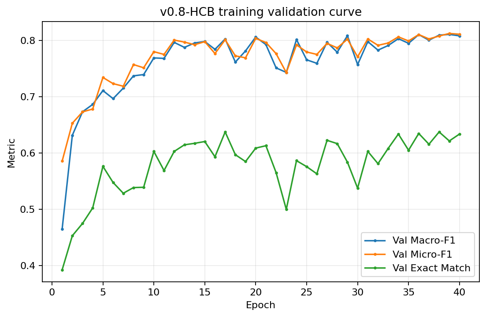
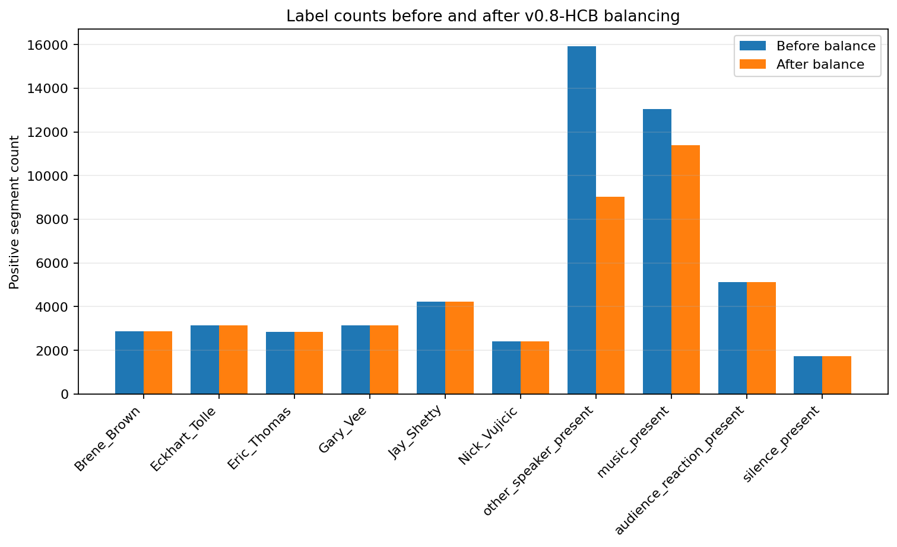
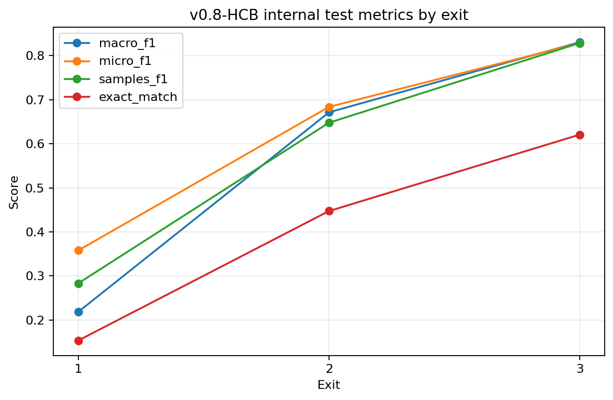
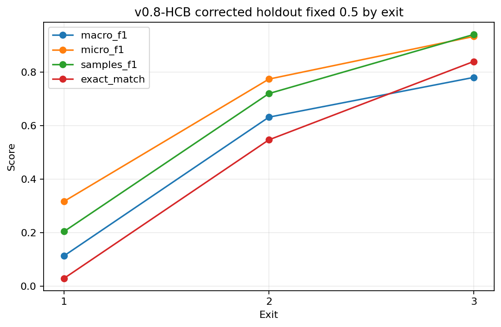
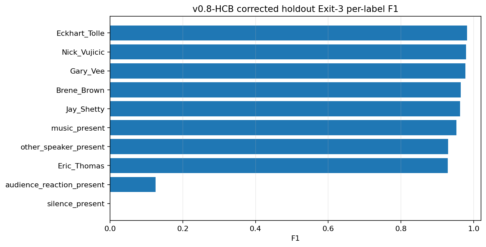
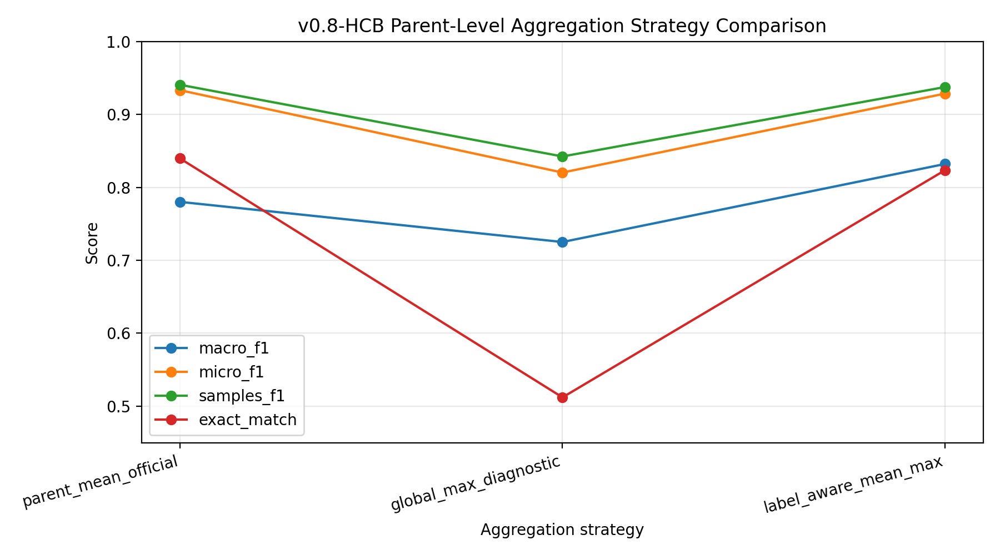

---

## Post-hoc label-aware aggregation finding

After the official v0.8-HCB corrected-holdout evaluation, an additional aggregation analysis was performed to understand the weak transient labels:

```text
audience_reaction_present
silence_present
```

The official parent-level mean result remains the main overall result:

| Method | Macro-F1 | Micro-F1 | Samples-F1 | Exact Match | Hamming Loss |
|---|---:|---:|---:|---:|---:|
| Parent mean, fixed 0.5 | 0.7801 | **0.9332** | **0.9406** | **0.8397** | **0.0194** |

However, global max aggregation showed that the weak transient labels were being diluted by mean aggregation:

| Label | Parent mean F1 | Global max F1 |
|---|---:|---:|
| `audience_reaction_present` | 0.1250 | **0.4706** |
| `silence_present` | 0.0000 | **0.1739** |

Global max was not suitable as the final method because it over-predicted labels:

| Method | Macro-F1 | Micro-F1 | Samples-F1 | Exact Match | Hamming Loss | Avg Pred Labels |
|---|---:|---:|---:|---:|---:|---:|
| Parent mean | **0.7801** | **0.9332** | **0.9406** | **0.8397** | **0.0194** | 1.4302 |
| Global max | 0.7251 | 0.8203 | 0.8423 | 0.5121 | 0.0630 | 2.0346 |

The best post-hoc compromise was label-aware aggregation:

```text
mean for 8 stable labels:
  Brene_Brown
  Eckhart_Tolle
  Eric_Thomas
  Gary_Vee
  Jay_Shetty
  Nick_Vujicic
  other_speaker_present
  music_present

max for 2 transient labels:
  audience_reaction_present
  silence_present
```

| Method | Macro-F1 | Micro-F1 | Samples-F1 | Exact Match | Hamming Loss |
|---|---:|---:|---:|---:|---:|
| Parent mean official | 0.7801 | **0.9332** | **0.9406** | **0.8397** | **0.0194** |
| Label-aware mean/max | **0.8320** | 0.9285 | 0.9375 | 0.8235 | 0.0211 |

**Interpretation:** parent mean remains the official overall result, while label-aware mean/max is an additional research finding showing that rare transient labels can be recovered without retraining.

## Updated figure locations

All v0.8 human-talk figures should be stored under:

```text
docs/figures/human_talk/agentic_data_preprocessing_v0.8/
```

Recommended v0.8 figure references:

```markdown












```

## Updated documentation map

The v0.8 human-talk documentation should use these locations:

```text
docs/reports/human_talk/V08_HUMAN_CORRECTED_BALANCED_EXPERIMENT_REPORT.md
docs/results/human_talk/V08_RESULTS_SUMMARY.md
docs/tables/agentic_data_preprocessing_v0.8/
docs/figures/human_talk/agentic_data_preprocessing_v0.8/
docs/COMMANDS_V08.md
docs/APPENDIX.md
docs/MULTILABEL_EXPERIMENT_LOG.md
```
