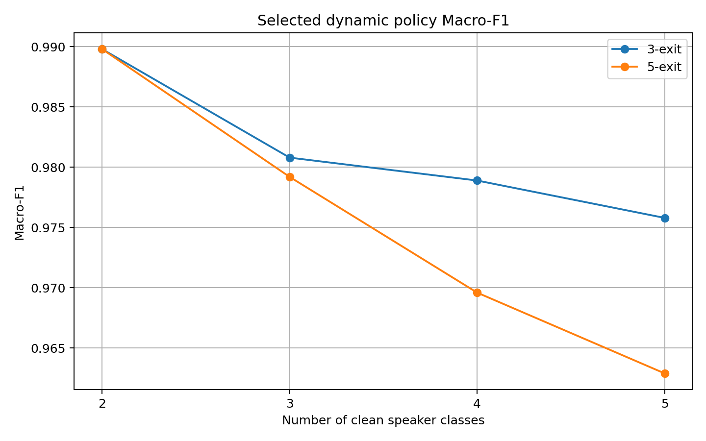
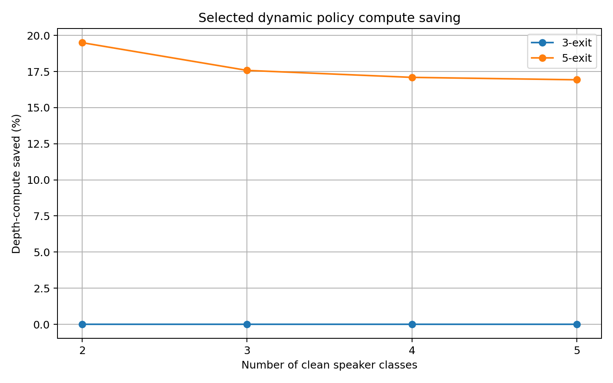
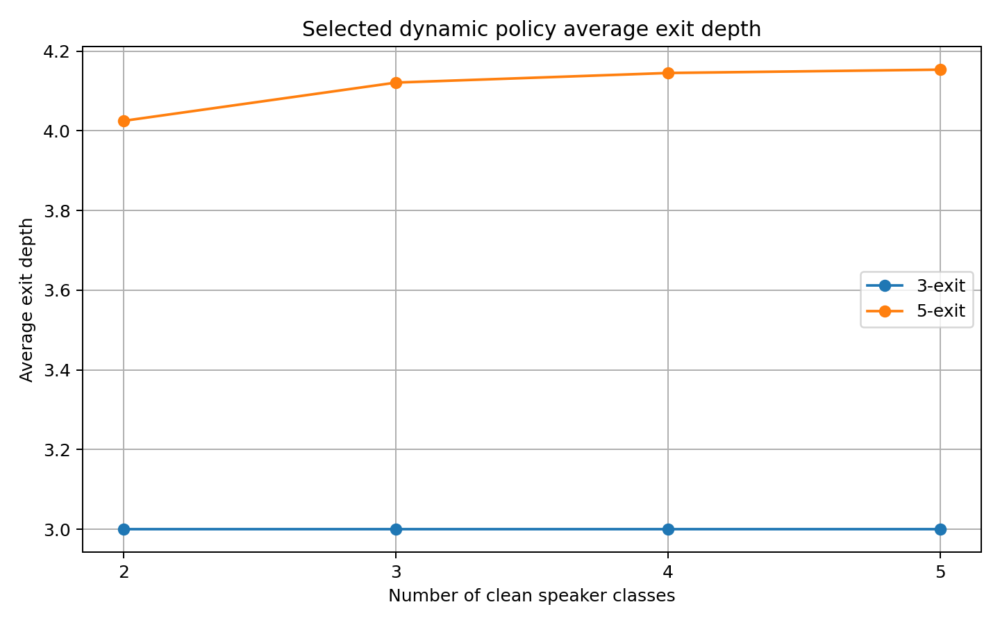
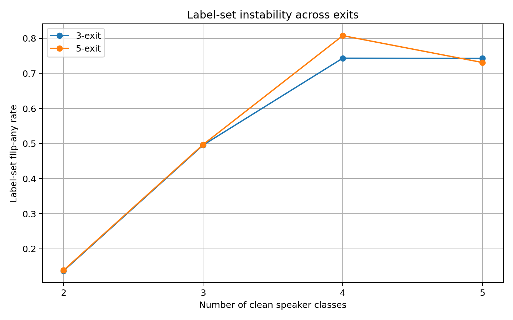
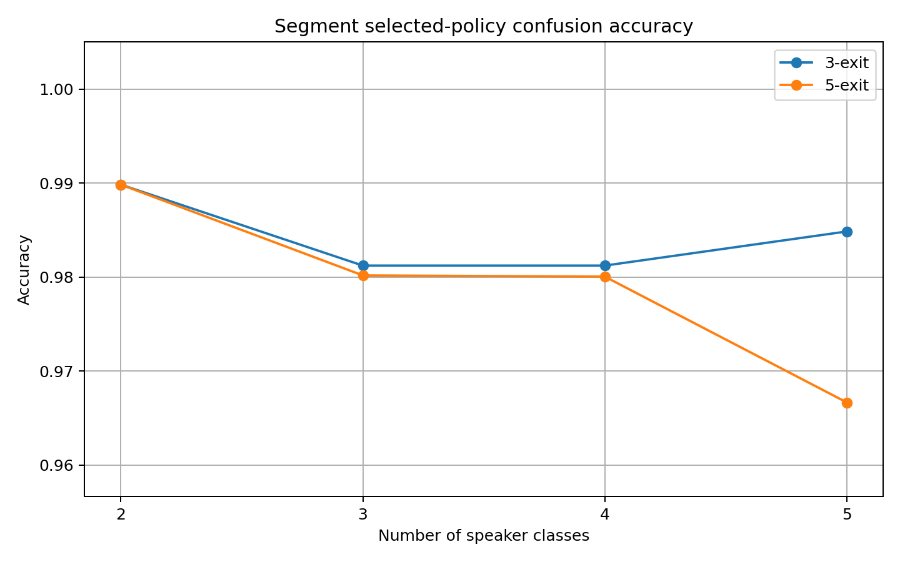
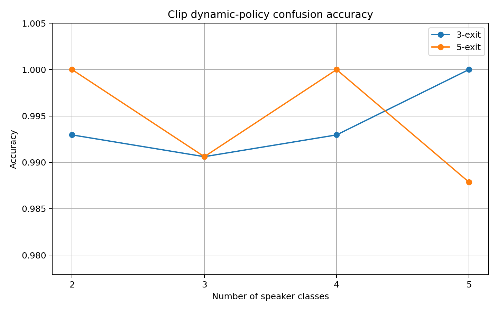
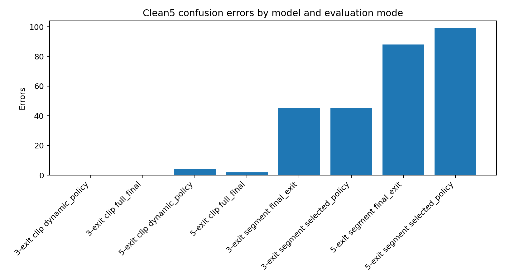
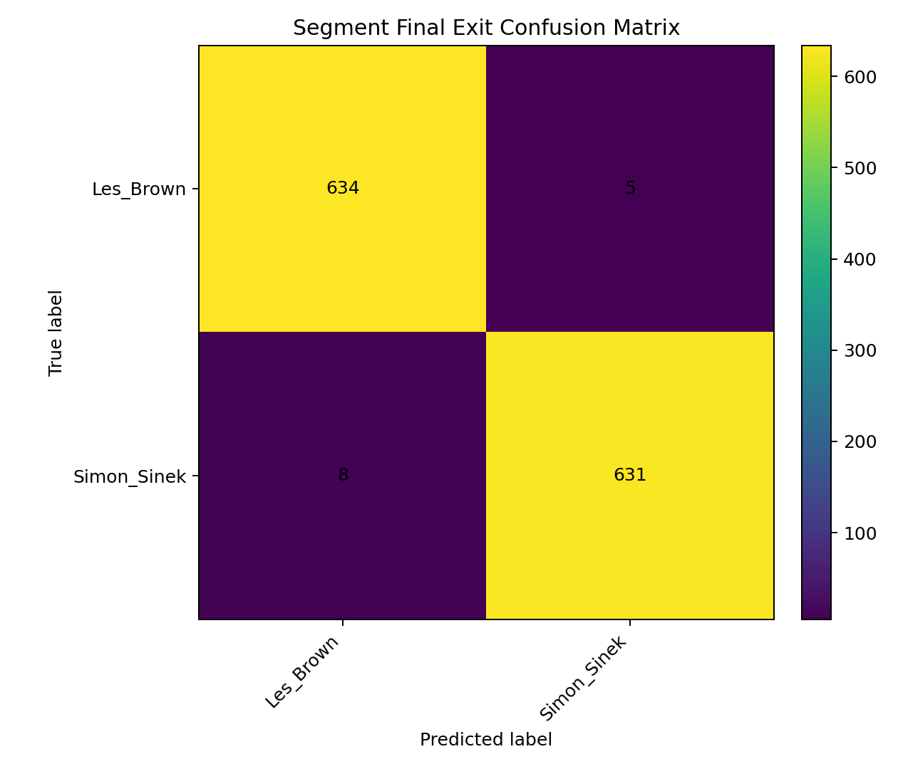
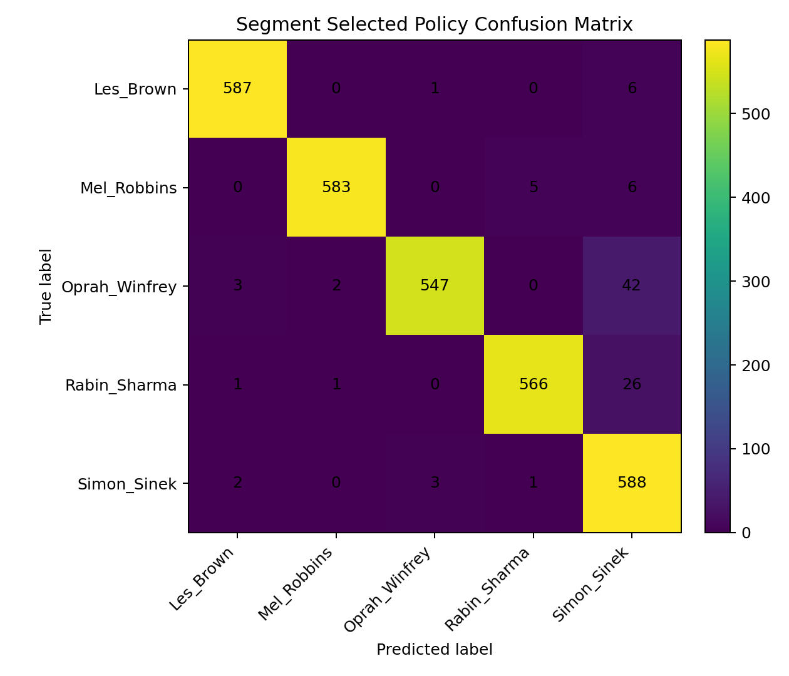
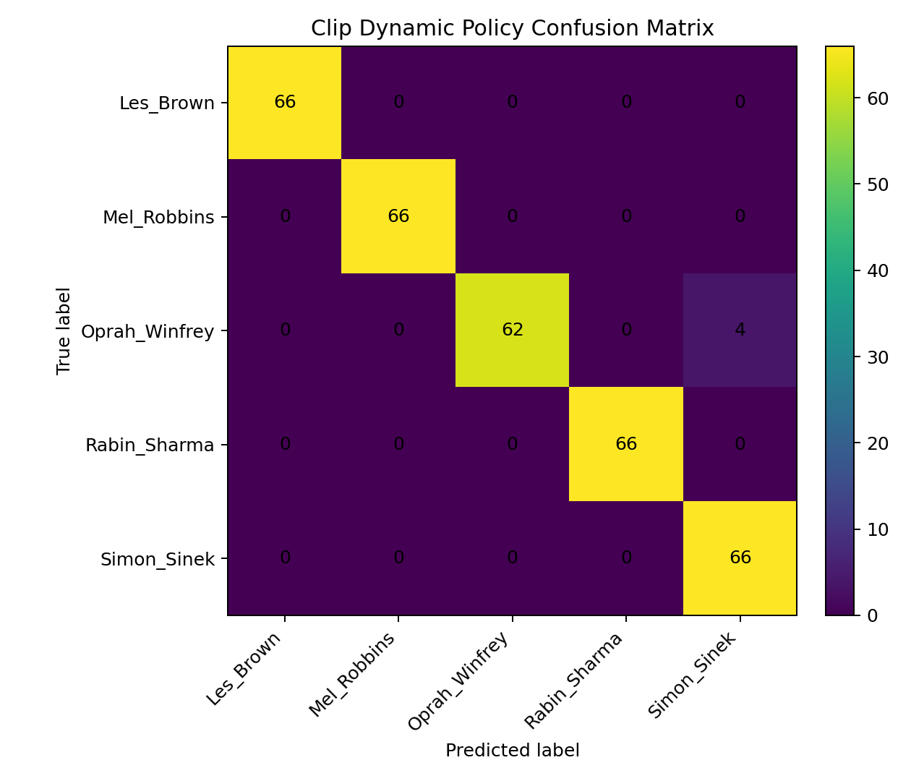

# NeuroAccuExit Human-Talk Incremental Evaluation + Agentic Preprocessing

This documentation covers the NeuroAccuExit TinyAudioCNN + ExitNet early-exit pipeline on the clean human-talk benchmark and the newer agentic preprocessing extension for Raw5 speaker data. The branch is now documented as a **staged human-talk / speaker-identification study**, not as the earlier loss-weight ablation branch.

```text
Branch: kexit_human_talk_incremental_eval
Task: clean human-talk speaker classification
Model family: TinyAudioCNN + ExitNet
Compared models: 3-exit no-hint vs 5-exit no-hint
Input representation: 64-mel log-mel features
Segment setup: 1.0 s windows, 0.5 s hop
Policy: sigmoid multi-label label-set stability
Main outputs: segment-level early-exit metrics, clip-level confusion analysis, confusion matrices
```

---

## Executive summary

1. Four clean stages were evaluated: `clean2_balanced`, `clean3_balanced`, `clean4_balanced`, and `clean5_balanced`.
2. The model scales smoothly as clean speaker classes increase from 2 to 5.
3. The **3-exit model is the stronger accuracy baseline** across the staged benchmark.
4. The **5-exit model is the efficiency-oriented dynamic model**, saving about `16.93%–19.50%` estimated depth compute under the selected segment-level policy.
5. Clip-level aggregation/confusion results are stronger than segment-level results, showing that clip aggregation smooths isolated 1-second segment mistakes.
6. `Simon_Sinek` is the most frequent weak/confused class in the segment-level clean stages, especially under the 5-exit selected policy.
7. AUPRC remains high across all stages, indicating strong probability ranking even when thresholded F1/exact-match drops.
8. Confusion matrices are reported as **single-label speaker-identification views** of a model trained through a multi-label pipeline.

---

<!-- AGENTIC_RAW5_RESULTS_START -->

## Latest agentic preprocessing result — Raw5 cleaned speaker stage

This branch now includes the first agentic preprocessing result on the five-speaker Raw5 stage.

```text
Branch: agentic_data_preprocessing
Run: raw5_agentic_cleaned_3exit_greedy_final_001
Timestamp UTC: 2026-05-22T11:32:45Z
Dataset stage: raw5_agentic_cleaned
Task: five-speaker human-talk classification
Model: TinyAudioCNN + ExitNet
Exits: 3
Tap blocks: [1, 3]
Policy: greedy segment policy + full-clip and Depth×Time clip evaluation
Final cleaned training pool: 3,108 files after one manually verified music-only file was excluded
```

### Agentic preprocessing status

| Item | Count / value |
|---|---:|
| Raw5 files audited | 3,170 |
| Accepted by agent | 3,109 |
| Needs review | 27 |
| Rejected | 34 |
| Blocked | 0 |
| Cleaned files built | 3,109 |
| Manually excluded after cleaned re-audit | 1 |
| Final training-ready cleaned files | 3,108 |

The manually excluded file is `Eric_Thomas__0175.wav`, which was verified as pure music with no target speaker. It is preserved outside the training root for traceability.

| Class | Final cleaned files |
|---|---:|
| `Brene_Brown` | 595 |
| `Eckhart_Tolle` | 660 |
| `Eric_Thomas` | 593 |
| `Gary_Vee` | 642 |
| `Jay_Shetty` | 618 |
| **Total** | **3,108** |

### First Raw5 agentic-cleaned result

| Evaluation mode | Accuracy | Samples / windows | Avg exit depth | Avg windows used | Windows saved | Compute saved |
|---|---:|---:|---:|---:|---:|---:|
| Segment greedy policy | 96.83% | 4040 windows | 2.089 | — | — | 52.56% vs full-depth segment |
| Full-clip greedy aggregation | 99.57% | 467 clips / 4040 windows | 2.089 | 8.651 / 8.651 | 0.00% | 0.00% |
| Depth×Time clip greedy | 98.93% | 467 clips / 975 used windows | 2.092 | 2.088 / 8.651 | 75.87% | 75.82% |

### Per-exit static quality

| Exit | Accuracy | Macro-F1 | Weighted-F1 | Test windows |
|---|---:|---:|---:|---:|
| Exit 1 | 65.62% | 64.04% | 64.36% | 4040 |
| Exit 2 | 92.40% | 92.29% | 92.37% | 4040 |
| Exit 3 / Final | 97.60% | 97.56% | 97.59% | 4040 |

### Early-exit behaviour

| Metric | Value |
|---|---:|
| Exit 1 usage | 18.71% |
| Exit 2 usage | 53.71% |
| Exit 3 usage | 27.57% |
| Average exit depth | 2.089 |
| Flip-any rate | 35.79% |
| Average flip count | 0.401 |
| Exit consistency | 99.13% |
| Policy threshold `tau` | 0.95 |
| Policy ECE | 0.0104 |

### Clip-level interpretation

| Evaluation | Mistake summary |
|---|---|
| Full-clip greedy | 2 wrong clips: `Brene_Brown → Eric_Thomas` (1), `Gary_Vee → Jay_Shetty` (1) |
| Depth×Time greedy | 5 wrong clips: `Brene_Brown → Gary_Vee` (3), `Eric_Thomas → Jay_Shetty` (1), `Gary_Vee → Eckhart_Tolle` (1) |

The key result is that Depth×Time retains **98.93%** clip accuracy while using only **24.13%** of available windows. This saves **75.87%** windows and **75.82%** compute relative to full-clip processing.

### Reproducibility note

The cache path records the CLI bandpass setting as `bp50-7600`, while `config_used.yaml` still contains the base YAML bandpass `[100, 3000]`. For reporting this run, treat the CLI/cache setting as the effective run setting and patch the config-save logic in a later reproducibility cleanup.

<!-- AGENTIC_RAW5_RESULTS_END -->

---

## Research question

> Can the K-exit NeuroAccuExit audio model generalise from previous multi-label environmental audio experiments to a clean human-talk speaker benchmark, and does adding more exits improve the accuracy/compute trade-off?

## Research answer

Yes, the architecture generalises well to clean speaker classification. However, the 5-exit model should **not** be claimed as more accurate than the 3-exit model. The 3-exit model is the accuracy baseline; the 5-exit model provides a dynamic efficiency trade-off by saving estimated depth compute while retaining high performance.

---

## Dataset stages

Each parent clip is approximately 5 seconds and is segmented into 1-second child windows with 0.5-second hop, giving 9 windows per parent clip.

| stage   |   n_labels | labels                                                           |   n_parent_clips |   n_segments |   train_segments |   val_segments |   test_segments |
|:--------|-----------:|:-----------------------------------------------------------------|-----------------:|-------------:|-----------------:|---------------:|----------------:|
| clean2  |          2 | Les_Brown, Simon_Sinek                                           |              944 |         8496 |             5940 |           1278 |            1278 |
| clean3  |          3 | Les_Brown, Simon_Sinek, Rabin_Sharma                             |             1416 |        12744 |             8910 |           1917 |            1917 |
| clean4  |          4 | Les_Brown, Simon_Sinek, Rabin_Sharma, Oprah_Winfrey              |             1888 |        16992 |            11880 |           2556 |            2556 |
| clean5  |          5 | Les_Brown, Mel_Robbins, Oprah_Winfrey, Rabin_Sharma, Simon_Sinek |             2205 |        19845 |            13905 |           2970 |            2970 |

---

## Main segment-level selected-policy results

These are the main multi-label early-exit results. Macro-F1, Exact Match, Hamming Loss, Jaccard, and AUPRC are the primary scientific metrics; compute saving is estimated using exit-depth units.

| stage   | model_type   |   macro_f1 |   exact_match |   hamming_loss |   hamming_accuracy |   jaccard_score |   macro_auprc |   avg_exit_depth |   depth_compute_saved_pct |   exit_consistency |   label_set_flip_any_rate |
|:--------|:-------------|-----------:|--------------:|---------------:|-------------------:|----------------:|--------------:|-----------------:|--------------------------:|-------------------:|--------------------------:|
| clean2  | 3-exit       |     0.9898 |        0.9898 |         0.0102 |             0.9898 |          0.9898 |        0.9996 |           3      |                    0      |             1      |                    0.1369 |
| clean2  | 5-exit       |     0.9898 |        0.9898 |         0.0102 |             0.9898 |          0.9898 |        0.9989 |           4.025  |                   19.4992 |             0.9953 |                    0.1385 |
| clean3  | 3-exit       |     0.9808 |        0.975  |         0.0127 |             0.9873 |          0.9763 |        0.9976 |           3      |                    0      |             1      |                    0.4956 |
| clean3  | 5-exit       |     0.9792 |        0.9729 |         0.0137 |             0.9863 |          0.9755 |        0.9955 |           4.121  |                   17.5796 |             0.987  |                    0.4971 |
| clean4  | 3-exit       |     0.9789 |        0.9667 |         0.0105 |             0.9895 |          0.9705 |        0.9976 |           3      |                    0      |             1      |                    0.7433 |
| clean4  | 5-exit       |     0.9696 |        0.9515 |         0.0154 |             0.9846 |          0.9634 |        0.995  |           4.1451 |                   17.097  |             0.9855 |                    0.8075 |
| clean5  | 3-exit       |     0.9758 |        0.9589 |         0.0096 |             0.9904 |          0.9655 |        0.9976 |           3      |                    0      |             1      |                    0.7428 |
| clean5  | 5-exit       |     0.9629 |        0.9414 |         0.0152 |             0.9848 |          0.954  |        0.994  |           4.1535 |                   16.9293 |             0.9778 |                    0.731  |

---

## 3-exit vs 5-exit selected-policy comparison

Positive delta means 5-exit is better. Negative delta means 3-exit is better.

| stage   |   macro_f1_3exit |   macro_f1_5exit |   macro_f1_delta_5_minus_3 |   exact_match_3exit |   exact_match_5exit |   compute_saved_3exit_pct |   compute_saved_5exit_pct |   exit_consistency_5exit |   flip_rate_5exit |
|:--------|-----------------:|-----------------:|---------------------------:|--------------------:|--------------------:|--------------------------:|--------------------------:|-------------------------:|------------------:|
| clean2  |           0.9898 |           0.9898 |                     0      |              0.9898 |              0.9898 |                         0 |                   19.4992 |                   0.9953 |            0.1385 |
| clean3  |           0.9808 |           0.9792 |                    -0.0016 |              0.975  |              0.9729 |                         0 |                   17.5796 |                   0.987  |            0.4971 |
| clean4  |           0.9789 |           0.9696 |                    -0.0093 |              0.9667 |              0.9515 |                         0 |                   17.097  |                   0.9855 |            0.8075 |
| clean5  |           0.9758 |           0.9629 |                    -0.0129 |              0.9589 |              0.9414 |                         0 |                   16.9293 |                   0.9778 |            0.731  |

**Interpretation:** the 5-exit model gives useful compute saving, but its Macro-F1 advantage disappears after `clean2`. From `clean3` onward, 3-exit is more accurate.

---

## Final-exit static quality

This table evaluates the deepest exit only and ignores dynamic early stopping.

| stage   | model_type   |   exit |   macro_f1 |   exact_match |   hamming_loss |   macro_auprc |
|:--------|:-------------|-------:|-----------:|--------------:|---------------:|--------------:|
| clean2  | 3-exit       |      3 |     0.9898 |        0.9898 |         0.0102 |        0.9996 |
| clean2  | 5-exit       |      5 |     0.993  |        0.993  |         0.007  |        0.9998 |
| clean3  | 3-exit       |      3 |     0.9808 |        0.975  |         0.0127 |        0.9976 |
| clean3  | 5-exit       |      5 |     0.9795 |        0.9697 |         0.0136 |        0.9972 |
| clean4  | 3-exit       |      3 |     0.9789 |        0.9667 |         0.0105 |        0.9976 |
| clean4  | 5-exit       |      5 |     0.9724 |        0.9566 |         0.0139 |        0.9967 |
| clean5  | 3-exit       |      3 |     0.9758 |        0.9589 |         0.0096 |        0.9976 |
| clean5  | 5-exit       |      5 |     0.9654 |        0.9451 |         0.0141 |        0.996  |

---

## Confusion-matrix summary

Confusion matrices are single-label views. They are valid here because each clean speaker segment/clip has one true speaker label.

| stage   | model_type   | level   | policy          |   n_samples |   accuracy |   errors | worst_class   |   worst_class_f1 |
|:--------|:-------------|:--------|:----------------|------------:|-----------:|---------:|:--------------|-----------------:|
| clean2  | 3-exit       | clip    | dynamic_policy  |         142 |     0.993  |        1 | Simon_Sinek   |           0.9929 |
| clean2  | 3-exit       | clip    | full_final      |         142 |     1      |        0 | Les_Brown     |           1      |
| clean2  | 5-exit       | clip    | dynamic_policy  |         142 |     1      |        0 | Les_Brown     |           1      |
| clean2  | 5-exit       | clip    | full_final      |         142 |     1      |        0 | Les_Brown     |           1      |
| clean2  | 3-exit       | segment | selected_policy |        1278 |     0.9898 |       13 | Simon_Sinek   |           0.9898 |
| clean2  | 5-exit       | segment | selected_policy |        1278 |     0.9898 |       13 | Les_Brown     |           0.9898 |
| clean3  | 3-exit       | clip    | dynamic_policy  |         213 |     0.9906 |        2 | Simon_Sinek   |           0.9859 |
| clean3  | 3-exit       | clip    | full_final      |         213 |     1      |        0 | Les_Brown     |           1      |
| clean3  | 5-exit       | clip    | dynamic_policy  |         213 |     0.9906 |        2 | Simon_Sinek   |           0.9859 |
| clean3  | 5-exit       | clip    | full_final      |         213 |     1      |        0 | Les_Brown     |           1      |
| clean3  | 3-exit       | segment | selected_policy |        1917 |     0.9812 |       36 | Simon_Sinek   |           0.9739 |
| clean3  | 5-exit       | segment | selected_policy |        1917 |     0.9802 |       38 | Simon_Sinek   |           0.9721 |
| clean4  | 3-exit       | clip    | dynamic_policy  |         284 |     0.993  |        2 | Simon_Sinek   |           0.9859 |
| clean4  | 3-exit       | clip    | full_final      |         284 |     0.9965 |        1 | Oprah_Winfrey |           0.9929 |
| clean4  | 5-exit       | clip    | dynamic_policy  |         284 |     1      |        0 | Les_Brown     |           1      |
| clean4  | 5-exit       | clip    | full_final      |         284 |     1      |        0 | Les_Brown     |           1      |
| clean4  | 3-exit       | segment | selected_policy |        2556 |     0.9812 |       48 | Simon_Sinek   |           0.9734 |
| clean4  | 5-exit       | segment | selected_policy |        2556 |     0.98   |       51 | Simon_Sinek   |           0.9719 |
| clean5  | 3-exit       | clip    | dynamic_policy  |         330 |     1      |        0 | Les_Brown     |           1      |
| clean5  | 3-exit       | clip    | full_final      |         330 |     1      |        0 | Les_Brown     |           1      |
| clean5  | 5-exit       | clip    | dynamic_policy  |         330 |     0.9879 |        4 | Oprah_Winfrey |           0.9688 |
| clean5  | 5-exit       | clip    | full_final      |         330 |     0.9939 |        2 | Oprah_Winfrey |           0.9846 |
| clean5  | 3-exit       | segment | selected_policy |        2970 |     0.9848 |       45 | Simon_Sinek   |           0.9702 |
| clean5  | 5-exit       | segment | selected_policy |        2970 |     0.9667 |       99 | Simon_Sinek   |           0.9319 |

---

## Clean5 per-class segment confusion analysis

The clean5 stage is the most important scalability stage. The table below shows the selected-policy per-class confusion statistics.

| model_type   | label         |   precision |   recall |     f1 |   support |   predicted |   tp |   fp |   fn |
|:-------------|:--------------|------------:|---------:|-------:|----------:|------------:|-----:|-----:|-----:|
| 3-exit       | Les_Brown     |      1      |   0.9949 | 0.9975 |       594 |         591 |  591 |    0 |    3 |
| 3-exit       | Mel_Robbins   |      0.9966 |   0.9916 | 0.9941 |       594 |         591 |  589 |    2 |    5 |
| 3-exit       | Oprah_Winfrey |      0.9832 |   0.9832 | 0.9832 |       594 |         594 |  584 |   10 |   10 |
| 3-exit       | Rabin_Sharma  |      0.9626 |   0.9966 | 0.9793 |       594 |         615 |  592 |   23 |    2 |
| 3-exit       | Simon_Sinek   |      0.9827 |   0.9579 | 0.9702 |       594 |         579 |  569 |   10 |   25 |
| 5-exit       | Les_Brown     |      0.9899 |   0.9882 | 0.989  |       594 |         593 |  587 |    6 |    7 |
| 5-exit       | Mel_Robbins   |      0.9949 |   0.9815 | 0.9881 |       594 |         586 |  583 |    3 |   11 |
| 5-exit       | Oprah_Winfrey |      0.9927 |   0.9209 | 0.9555 |       594 |         551 |  547 |    4 |   47 |
| 5-exit       | Rabin_Sharma  |      0.9895 |   0.9529 | 0.9708 |       594 |         572 |  566 |    6 |   28 |
| 5-exit       | Simon_Sinek   |      0.8802 |   0.9899 | 0.9319 |       594 |         668 |  588 |   80 |    6 |

Key observation: for the 5-exit selected policy, `Simon_Sinek` has high recall but lower precision, meaning the model over-predicts this class. `Oprah_Winfrey` and `Rabin_Sharma` also lose recall in the 5-exit selected policy compared with the 3-exit model.

---

## Figures

### Segment-level early-exit trends









### Confusion-matrix trends







### Example confusion matrices








---

## Reproducibility commands

### 1. Checkout branch

```powershell
git checkout kexit_human_talk_incremental_eval
git pull origin kexit_human_talk_incremental_eval
```

### 2. Full clean-stage experiments

```powershell
powershell -ExecutionPolicy Bypass -File .\scripts\run_human_talk_clean_stage_experiment.ps1 `
  -Stage clean2_balanced `
  -RawRoot human_talk_dataset `
  -WorkspaceRoot human_talk_workspace `
  -Device cpu `
  -Clean `
  -ZipResults
```

```powershell
powershell -ExecutionPolicy Bypass -File .\scripts\run_human_talk_clean_stage_experiment.ps1 `
  -Stage clean3_balanced `
  -RawRoot human_talk_dataset `
  -WorkspaceRoot human_talk_workspace `
  -Device cpu `
  -Clean `
  -ZipResults
```

```powershell
powershell -ExecutionPolicy Bypass -File .\scripts\run_human_talk_clean_stage_experiment.ps1 `
  -Stage clean4_balanced `
  -RawRoot human_talk_dataset `
  -WorkspaceRoot human_talk_workspace `
  -Device cpu `
  -Clean `
  -ZipResults
```

```powershell
powershell -ExecutionPolicy Bypass -File .\scripts\run_human_talk_clean_stage_experiment.ps1 `
  -Stage clean5_balanced `
  -RawRoot human_talk_dataset `
  -WorkspaceRoot human_talk_workspace `
  -Device cpu `
  -Clean `
  -ZipResults
```

### 3. Evaluation-only refresh after metric/script updates

```powershell
powershell -ExecutionPolicy Bypass -File .\scripts\run_human_talk_clean_stage_experiment.ps1 `
  -Stage clean5_balanced `
  -RawRoot human_talk_dataset `
  -WorkspaceRoot human_talk_workspace `
  -Device cpu `
  -SkipPrepare `
  -SkipFeatures `
  -SkipTrain3 `
  -SkipTrain5 `
  -ZipResults
```

### 4. Clip/window-level evaluation

```powershell
powershell -ExecutionPolicy Bypass -File .\scripts\run_human_talk_clip_eval_all.ps1 `
  -WorkspaceRoot human_talk_workspace `
  -Device cpu `
  -ZipResults
```

### 5. Confusion-matrix export

```powershell
powershell -ExecutionPolicy Bypass -File .\scripts\run_human_talk_confusion_eval_all.ps1 `
  -WorkspaceRoot human_talk_workspace `
  -Device cpu `
  -ZipResults
```

Package existing confusion outputs only:

```powershell
powershell -ExecutionPolicy Bypass -File .\scripts\run_human_talk_confusion_eval_all.ps1 `
  -WorkspaceRoot human_talk_workspace `
  -ZipOnly `
  -ZipResults
```

---

## Reporting guidance

Use this wording:

> The 3-exit model provides the strongest accuracy baseline across the clean human-talk stages. The 5-exit model provides a practical dynamic early-exit trade-off, saving approximately 16.9%–19.5% estimated depth compute while retaining high speaker-classification performance. Confusion-matrix analysis shows that clip-level aggregation improves robustness, while segment-level errors increase with class count, particularly around `Simon_Sinek`.
---

## Known limitations

1. The current clean speaker stages are stored in a multi-label pipeline but are effectively single-label tasks.
2. Confusion matrices require argmax-style conversion when predictions are empty or multi-positive.
3. Estimated compute saving is based on exit-depth units, not measured device latency.
4. Event detection latency is not applicable to persistent speaker labels. It should be used later for transient labels such as gunshot.
5. Future experiments should evaluate tuned thresholds, real FLOPs/latency, and noisy/raw speaker classes.

---

## Main conclusion

The staged human-talk benchmark confirms that NeuroAccuExit can generalise to clean speaker-identification data. Performance degrades smoothly rather than collapsing as the class count increases from two to five. The 3-exit model remains the strongest accuracy baseline, while the 5-exit model is valuable as an efficiency-oriented dynamic model. The confusion analysis strengthens the interpretation by showing that clip-level aggregation can recover from isolated segment errors and that the dominant segment-level confusion in the hardest stage involves `Simon_Sinek`.
