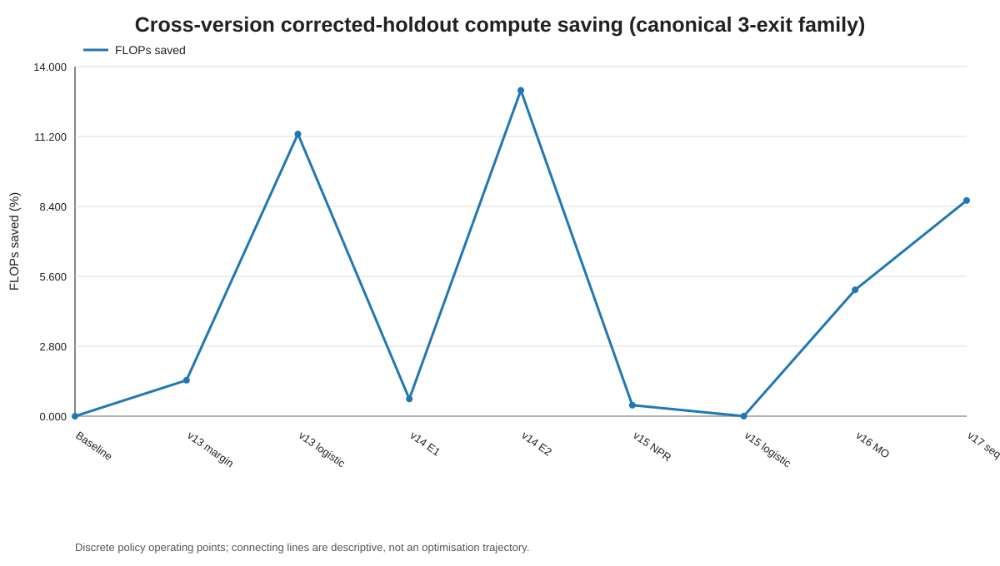
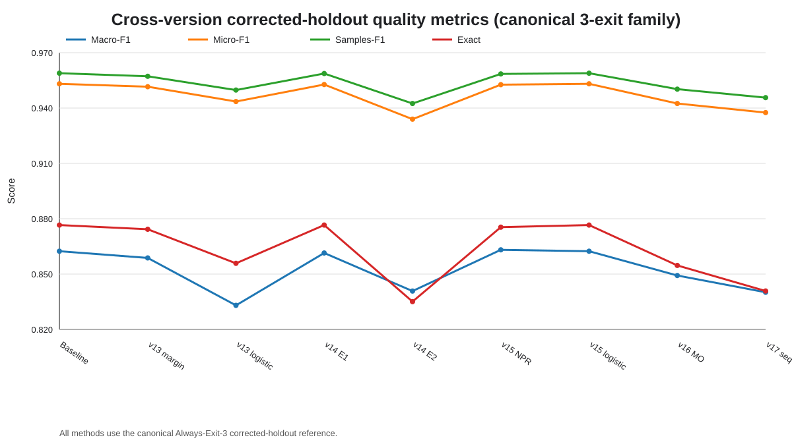
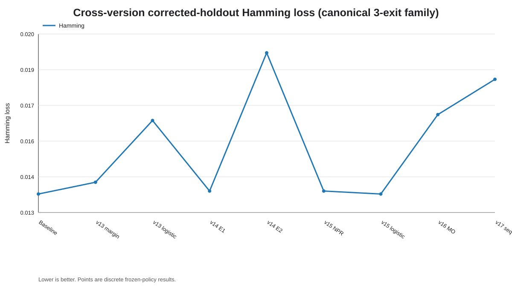
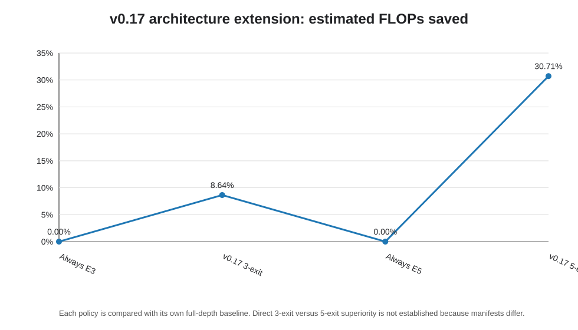

# NeuroAccuExit-ASHADIP — Active Budget and Anytime Exit v0.4

This branch studies **genuine computation-adaptive inference** for multi-label human-talk audio classification. It preserves the completed v0.16 multi-objective experiment and adds v0.17's fully sequential anytime policy across every available exit.

The primary v0.17 routes are:

```text
3-exit: Exit 1 → Exit 2 → Exit 3
5-exit: Exit 1 → Exit 2 → Exit 3 → Exit 4 → Exit 5
```

The checkpoints are frozen. The branch changes inference-time stopping, validation-time policy optimisation, staged execution, timing, and reporting; it does not retrain the CNN backbone or exit heads.

---

## Branch identity

| Item | Value |
|---|---|
| Git branch | `active_budget_anytime_exit_v0.4` |
| Source branch | `active_budget_anytime_exit_v0.3` |
| Task | 10-label human-talk speaker/context classification |
| Current completed milestone | `v0.17_EE` sequential active-budget anytime exit |
| Previous milestone | `v0.16_EE` multi-objective per-label Exit-2 margin optimisation |
| Canonical 3-exit checkpoint | `main_v010_human_corrected_balanced_3exit_no_hint_20260703_201845` |
| Tested 5-exit checkpoint | `main_v06_expanded_5exit_20260603_210324` |
| Canonical 3-exit quality reference | Always Exit 3 + frozen historical LATS-v2 |
| 5-exit within-model reference | Always Exit 5 + the same frozen LATS-v2 evaluator |
| Full integration | Complete for both tested checkpoints, corrected holdout, ablations, and 30-repeat CPU timing |

---

## Current scientific verdict

| Finding | Decision |
|---|---|
| 5-exit full sequential policy | **Major within-checkpoint success** |
| 3-exit full sequential policy | Real compute saving and speedup, but **not holdout quality-safe** |
| Exit 1 | Useful, but the riskiest stage |
| Label-specific margins | Essential |
| Previous-exit stability | Useful safety mechanism |
| Current risk term | Non-binding under selected policies |
| Direct 5-exit vs 3-exit superiority | **Not established** because the training/validation manifests differ |

The strongest confirmed v0.17 result is:

> Within the tested 5-exit checkpoint, `52.94%` of holdout segments stopped before Exit 5, `30.71%` estimated FLOPs were saved, median CPU speed improved by `1.114×`, and all predefined holdout-quality limits were met.

This must not be rewritten as “five exits are better than three exits” until a fair five-exit checkpoint is trained with the exact canonical 3-exit manifest and preprocessing.

---

## Full-depth references

### Canonical three-exit reference

```text
v0.10 no-hint + frozen historical LATS-v2 + Always Exit 3
```

| Metric | Value |
|---|---:|
| Parent Macro-F1 | 0.862382 |
| Parent Micro-F1 | 0.953131 |
| Parent Samples-F1 | 0.958889 |
| Parent Exact Match | 0.876586 |
| Parent Hamming Loss ↓ | 0.013725 |
| Average exit depth | 3.000000 |
| Estimated FLOPs saved | 0% |
| 30-repeat CPU latency | 1.572119 ms/segment |
| Parent clips | 867 |

Frozen baseline package:

```text
docs/tables/active_budget_anytime_exit_v0.1/full_depth_baselines/
```

### Tested five-exit reference

```text
v0.6 expanded 5-exit checkpoint + frozen LATS-v2 + Always Exit 5
```

| Metric | Value |
|---|---:|
| Parent Macro-F1 | 0.810761 |
| Parent Micro-F1 | 0.869498 |
| Parent Samples-F1 | 0.887906 |
| Parent Exact Match | 0.673587 |
| Parent Hamming Loss ↓ | 0.038985 |
| Average exit depth | 5.000000 |
| Estimated FLOPs saved | 0% |
| 30-repeat CPU latency | 1.733976 ms/segment |

The five-exit baseline is architecture-specific and is not a replacement for the canonical three-exit baseline.

---

## Genuine staged inference

`models/anytime_exit_net.py` executes the network incrementally. Samples that stop are removed from the active batch and do not execute later backbone blocks.

Both checkpoints passed exact staged/full equivalence:

```text
maximum absolute logit difference       = 0.0
mean absolute logit difference          = 0.0
maximum absolute probability difference = 0.0
```

### Cumulative architecture costs

| Exit | 3-exit cumulative FLOPs | 5-exit cumulative FLOPs |
|---|---:|---:|
| Exit 1 | 1,861,952 | 1,861,952 |
| Exit 2 | 18,451,072 | 12,921,312 |
| Exit 3 | 51,629,312 | 18,451,072 |
| Exit 4 | — | 29,510,592 |
| Exit 5 | — | 51,629,312 |

---

## Version traceability

| Version | Implementation | Research question | Main outcome |
|---|---|---|---|
| `v0.11_EE` | Staged wrapper, fixed exits, global Exit-2/3 rule | Can the frozen checkpoint genuinely skip Blocks 4–5? | Genuine skipping established; 7.53% estimated saving, but substantial quality loss. |
| `v0.12_EE` | Validation-derived label-risk continuation | Should labels that improve at the final exit receive continuation protection? | Small improvement over v0.11; risk alone did not establish a stronger frontier. |
| `v0.13_EE` | Matched global, delta, label-risk, per-label-margin, and logistic policies | Which matched policy gives the best quality–compute trade-off? | Per-label margin became the quality-constrained adaptive baseline. |
| `v0.14_EE` | Parent-aware counterfactual gates and Exit-1 ablation | Can learned parent-harm targets improve safety, and is Exit 1 useful? | Exit-2 gate unsafe; Exit 1 preserved quality but stopped too rarely and slowed inference. |
| `v0.15_EE` | Whole-parent nonparametric and shared-logistic risk control | Does a joint parent decision correct multi-segment target mismatch? | Quality preserved, but coverage and real efficiency were negligible. |
| `v0.16_EE` | NSGA-II-style optimisation of the lightweight per-label Exit-2 rule | Can optimisation create meaningful saving and speedup? | 5.06% FLOPs and 1.015× speedup, but all holdout-quality limits failed. |
| `v0.17_EE` | Fully sequential 3-exit and 5-exit policies with safety-buffered Pareto-knee selection | Can every exit participate, and can more sequential opportunities improve the trade-off? | 3-exit compute-successful but unsafe; tested 5-exit policy met quality limits with 30.71% saving and 1.114× speedup. |

Detailed history:

```text
docs/active_budget_anytime_exit_v0.4/VERSION_HISTORY.md
```

---

## v0.17 sequential decision logic

At each non-final exit, the sample is evaluated using:

1. mean multi-label binary confidence;
2. ten label-specific decision margins;
3. maximum probability change from the preceding exit;
4. previous-exit label-set stability from Exit 2 onward;
5. validation-derived label-risk evidence;
6. a non-empty prediction requirement.

For exit `e` and label `l`:

```text
binary confidence = max(p[e,l], 1 − p[e,l])
decision margin   = |p[e,l] − threshold[e,l]|
probability delta = |p[e,l] − p[e−1,l]|
```

A sample stops at the first exit satisfying every active condition. Otherwise, it continues to the next exit.

The complete theoretical record is:

```text
docs/tables/active_budget_anytime_exit_v0.4/v0.17_EE/THEORY_AND_METHOD.md
```

---

## v0.17 optimiser settings

| Setting | Value |
|---|---:|
| Algorithm | Constraint-aware NSGA-II-style search |
| Population | 96 |
| Generations | 60 |
| Seed | 42 |
| Parent-grouped folds | 5 |
| Safety fraction | 0.75 |
| Minimum total early fraction | 0.020 |
| Minimum Exit-1 fraction | 0.005 |
| Segment threshold mode | `fixed_0p5` |
| Validation segments / parents | 1,883 / 304 |
| Holdout segments / parents | 4,335 / 867 |
| Batch size | 128 |
| Device | CPU |
| Torch/BLAS threads | 1 |
| Publication timing repetitions | 30 |
| 3-exit unique candidates / Pareto points | 5,847 / 19 |
| 5-exit unique candidates / Pareto points | 5,856 / 86 |

Every non-final exit has a separate 13-parameter block:

```text
[confidence threshold,
 maximum probability delta,
 maximum label risk,
 ten per-label margins]
```

### Validation quality constraints

| Metric | Limit |
|---|---:|
| Parent Macro-F1 drop | ≤ 0.010 |
| Parent Micro-F1 drop | ≤ 0.005 |
| Parent Exact-Match drop | ≤ 0.010 |
| Parent Hamming increase | ≤ 0.002 |

The selected candidate is a safety-buffered Pareto knee rather than v0.16's maximum-compute feasible point.

---

## Corrected-holdout headline

| Architecture | Method | Exit distribution | FLOPs saved | Speedup | Macro-F1 | Micro-F1 | Samples-F1 | Exact | Hamming ↓ |
|---|---|---|---:|---:|---:|---:|---:|---:|---:|
| 3-exit | Always final | `0/0/100%` | 0% | 1.000× | 0.862382 | 0.953131 | 0.958889 | 0.876586 | 0.013725 |
| 3-exit | Full sequential | `6.07/4.34/89.60%` | 8.64% | 1.037× | 0.840128 | 0.937549 | 0.945653 | 0.840830 | 0.018224 |
| 5-exit | Always final | `0/0/0/0/100%` | 0% | 1.000× | 0.810761 | 0.869498 | 0.887906 | 0.673587 | 0.038985 |
| 5-exit | Full sequential | `6.83/1.22/18.59/26.30/47.06%` | 30.71% | 1.114× | 0.801356 | 0.868859 | 0.886945 | 0.688581 | 0.039100 |

### Holdout quality audit

| Architecture | Macro drop | Micro drop | Exact drop | Hamming increase | All limits met? |
|---|---:|---:|---:|---:|---|
| 3-exit | 0.022254 | 0.015582 | 0.035755 | 0.004498 | **No** |
| 5-exit | 0.009406 | 0.000639 | -0.014994 | 0.000115 | **Yes** |

---

## Cross-version corrected-holdout ablation

The main cross-version comparison remains restricted to the **canonical 3-exit family**, because every row below is evaluated against the same Always-Exit-3 corrected-holdout reference.

| Method | FLOPs saved | Macro-F1 | Micro-F1 | Samples-F1 | Exact | Hamming ↓ |
|---|---:|---:|---:|---:|---:|---:|
| Always Exit 3 | 0.00% | 0.862382 | 0.953131 | 0.958889 | 0.876586 | 0.013725 |
| v0.13 per-label margin | 1.44% | 0.858748 | 0.951556 | 0.957198 | 0.874279 | 0.014187 |
| v0.13 logistic gate | 11.30% | 0.833034 | 0.943529 | 0.949750 | 0.855825 | 0.016609 |
| v0.14 Exit 1–3 ablation | 0.69% | 0.861442 | 0.952756 | 0.958697 | 0.876586 | 0.013841 |
| v0.14 Exit 2–3 gate | 13.05% | 0.840798 | 0.933966 | 0.942473 | 0.835063 | 0.019262 |
| v0.15 nonparametric parent risk | 0.44% | 0.863129 | 0.952681 | 0.958505 | 0.875433 | 0.013841 |
| v0.15 shared logistic parent gate | 0.00% | 0.862382 | 0.953131 | 0.958889 | 0.876586 | 0.013725 |
| v0.16 multi-objective margin | 5.06% | 0.849203 | 0.942474 | 0.950266 | 0.854671 | 0.016840 |
| **v0.17 sequential anytime (3-exit)** | **8.64%** | 0.840128 | 0.937549 | 0.945653 | 0.840830 | 0.018224 |

### Policy-structure traceability

| Method | Stop unit | Decision route | Interpretation |
|---|---|---|---|
| v0.13 per-label margin | Segment | Exit 2 → Exit 3 | Current quality-constrained 3-exit adaptive baseline |
| v0.14 Exit-1 ablation | Segment | Exit 1 → Exit 3 | Quality-preserving but insufficient coverage |
| v0.15 parent-risk policies | Parent | Exit 2 → Exit 3 | Parent-consistent but computationally negligible |
| v0.16 multi-objective margin | Segment | Exit 2 → Exit 3 | Compute-forward but holdout-unsafe |
| v0.17 sequential anytime | Segment, sequential | Exit 1 → Exit 2 → Exit 3 | Uses both early exits; larger saving but holdout-unsafe |

The 3-exit table shows that v0.17 increases compute saving over v0.16 (`8.64%` versus `5.06%`) but does not preserve quality as safely as the lighter v0.13 and v0.14 operating points.

Machine-readable table:

```text
docs/tables/active_budget_anytime_exit_v0.4/v0.17_EE/cross_version_3exit_table.csv
```

### v0.17 five-exit architecture extension — reported separately

The 5-exit result is scientifically important, but it uses a different full-depth reference and a different training/validation manifest. It is therefore a **within-checkpoint architecture-extension result**, not a directly comparable row in the canonical 3-exit ranking.

| Method | FLOPs saved | Speedup | Macro-F1 | Micro-F1 | Samples-F1 | Exact | Hamming ↓ |
|---|---:|---:|---:|---:|---:|---:|---:|
| Always Exit 5 | 0.00% | 1.000× | 0.810761 | 0.869498 | 0.887906 | 0.673587 | 0.038985 |
| **v0.17 sequential anytime (5-exit)** | **30.71%** | **1.114×** | 0.801356 | 0.868859 | 0.886945 | **0.688581** | 0.039100 |

Machine-readable table:

```text
docs/tables/active_budget_anytime_exit_v0.4/v0.17_EE/v017_architecture_table.csv
```

### Cross-version figures









The line plots are descriptive summaries of the tabulated operating points. They should not be interpreted as continuous training curves or as a fair direct comparison between the 3-exit and 5-exit architectures.

---

## Ablation findings

### Exit 1

Exit 1 adds `5.24` percentage points of saving in the 3-exit policy and `3.91` points in the 5-exit policy. However, the No-Exit-1 variants preserve Macro-F1 and Micro-F1 more strongly. Exit 1 is useful but currently the riskiest stage.

### Label margins

Removing per-label margins caused severe quality collapse:

| Architecture | Full Macro-F1 | No-margin Macro-F1 | Full Exact | No-margin Exact |
|---|---:|---:|---:|---:|
| 3-exit | 0.840128 | 0.740154 | 0.840830 | 0.652826 |
| 5-exit | 0.801356 | 0.704487 | 0.688581 | 0.608997 |

### Stability

Removing previous-exit label stability increased compute saving but reduced quality. Stability is a meaningful safety mechanism.

### Risk

`no_risk` produced the same parent metrics as the full policy in both architectures. The current risk threshold is therefore non-binding and should not be claimed as a demonstrated improvement.

### Confidence only

Confidence-only stopping produced very large saving but severe quality degradation. Multi-label early exit requires label-aware safeguards.

---

## Per-label findings

### Recurrent high-risk labels

```text
audience_reaction_present
Nick_Vujicic
Eric_Thomas
other_speaker_present
```

### 5-exit improvements

- `silence_present`: `+0.0720` F1
- `music_present`: `+0.0157` F1
- `Eckhart_Tolle`: `+0.0060` F1
- `Jay_Shetty`: `+0.0054` F1

### 5-exit losses

- `Nick_Vujicic`: `−0.0949` F1
- `audience_reaction_present`: `−0.0851` F1
- `Eric_Thomas`: `−0.0106` F1

Aggregate metrics must therefore be accompanied by per-label results.

---

## Fairness audit

| Check | Result |
|---|---|
| Same labels | Pass |
| Same holdout/features | Pass |
| Same LATS-v2 configuration | Pass |
| Same threshold mode | Pass |
| Same optimiser budget | Pass |
| Same constraints | Pass |
| Same training/validation manifest | **Fail** |

The 3-exit model uses 25,519 training rows from the human-corrected balanced v0.8/v0.10 pipeline. The 5-exit model uses 30,950 rows from the earlier v0.6 expanded pipeline.

Safe conclusion:

> The tested five-exit checkpoint supports a stronger within-model sequential quality–compute trade-off. A fair architectural comparison remains future work.

---

## v0.16 retained result

v0.16 remains fully documented under:

```text
docs/tables/active_budget_anytime_exit_v0.4/v0.16_EE/
```

Its holdout result was:

| Exit-2 fraction | FLOPs saved | Speedup | Macro-F1 | Micro-F1 | Exact | Hamming ↓ |
|---:|---:|---:|---:|---:|---:|---:|
| 7.87% | 5.06% | 1.015× | 0.849203 | 0.942474 | 0.854671 | 0.016840 |

v0.16 achieved real acceleration but failed every holdout-quality limit. It remains a compute-forward Pareto ablation.

---

## Reproduction commands

### Three-exit only

```powershell
conda activate ASHADIP_V0

powershell -ExecutionPolicy Bypass `
  -File ".\scripts\v0.17_EE\sequential_anytime_exit\run_sequential_anytime_exit_v017_EE.ps1" `
  -Run3Only
```

### Complete tested 3-exit and 5-exit study

```powershell
powershell -ExecutionPolicy Bypass `
  -File ".\scripts\v0.17_EE\sequential_anytime_exit\run_sequential_anytime_exit_v017_EE.ps1" `
  -RunDir5 ".\human_talk_workspace\tata_v0.6_raw_pipeline\main_models\runs\main_v06_expanded_5exit_20260603_210324" `
  -TimingRepeats 30
```

### Frozen-policy reuse

```powershell
powershell -ExecutionPolicy Bypass `
  -File ".\scripts\v0.17_EE\sequential_anytime_exit\run_sequential_anytime_exit_v017_EE.ps1" `
  -RunDir5 ".\human_talk_workspace\tata_v0.6_raw_pipeline\main_models\runs\main_v06_expanded_5exit_20260603_210324" `
  -SkipPrechecks `
  -SkipTuning `
  -TimingRepeats 30
```

Full tuning, evaluation, reporting, and equivalence commands:

```text
docs/tables/active_budget_anytime_exit_v0.4/v0.17_EE/PS_COMMANDS.md
```

No v0.17 training command exists because both checkpoints are frozen.

---

## Documentation package

```text
docs/active_budget_anytime_exit_v0.4/
docs/tables/active_budget_anytime_exit_v0.4/v0.16_EE/
docs/tables/active_budget_anytime_exit_v0.4/v0.17_EE/
```

The v0.17 package contains method theory, setup, results, ablations, paper-ready wording, PowerShell commands, frozen policies, Pareto fronts, optimisation histories, holdout tables, per-label deltas, fairness records, machine-readable cross-version tables, and figures.

---

## Limitations and cautions

- Do not claim that five exits are superior to three exits from this comparison.
- The five-exit checkpoint uses a different training/validation manifest and a weaker full-depth baseline.
- The 3-exit sequential policy is validation-eligible but fails all holdout limits.
- The 5-exit success is relative to Always Exit 5, not to the canonical Always Exit 3 result.
- The frozen historical LATS-v2 configuration has calibration provenance related to the corrected holdout; this is not an independent external test.
- Segment thresholds were fixed at 0.5 because per-exit tuned threshold files were unavailable.
- The current risk mechanism is implemented but was non-binding in the ablations.
- CPU speedups are hardware-, threading-, batch-, and implementation-specific.
- Estimated FLOPs and measured latency are not interchangeable.
- The cross-version line plots connect discrete operating points; they are not optimisation trajectories.
- v0.17 freezes one operating point per architecture; it is not a runtime user-budget sweep.
- v0.17 stops the entire sample; it is not label-wise asynchronous inference.
- Evidence accumulation and distilled knowledge were not part of the primary v0.17 method.
- Holdout results must not be used for retuning and then presented as untouched evaluation.

---

## Current research decision

| Role | Method |
|---|---|
| Canonical 3-exit deployment-quality reference | Always Exit 3 + frozen LATS-v2 |
| 3-exit quality-constrained adaptive baseline | v0.13 per-label margin |
| 3-exit compute-forward ablation | v0.16 multi-objective margin |
| Current sequential research result | v0.17 |
| Successful within-checkpoint policy | v0.17 tested 5-exit full sequential |
| Unsuccessful v0.17 result | 3-exit full sequential holdout transfer |
| Required next confirmation | Train a fair 5-exit checkpoint on the canonical 3-exit manifest and repeat v0.17 |
