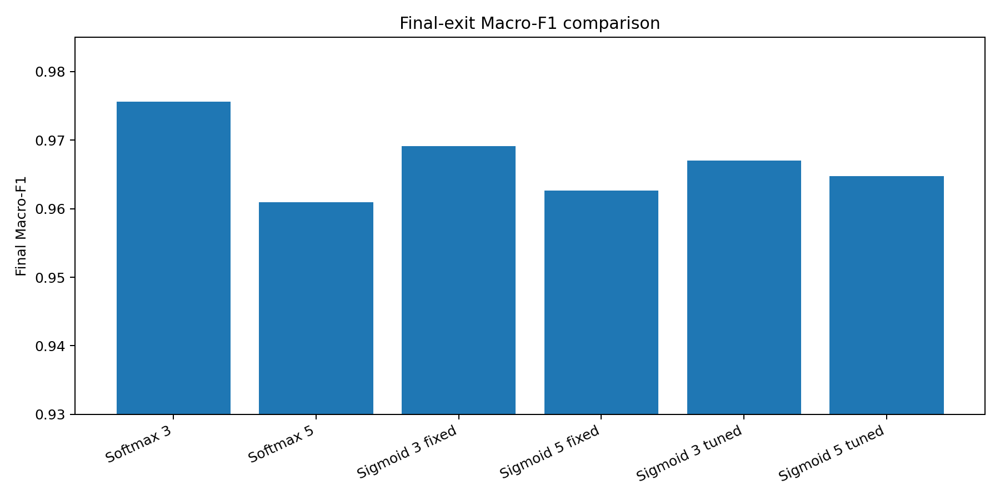
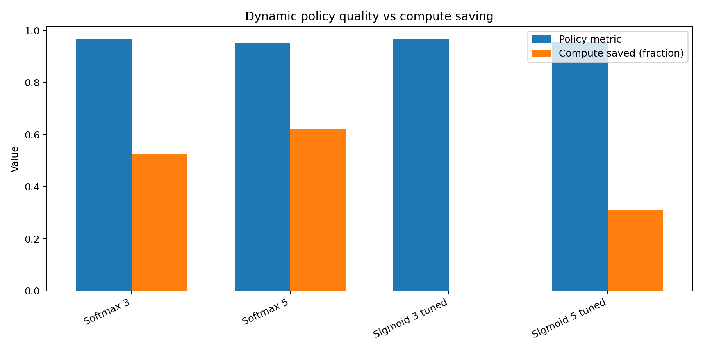
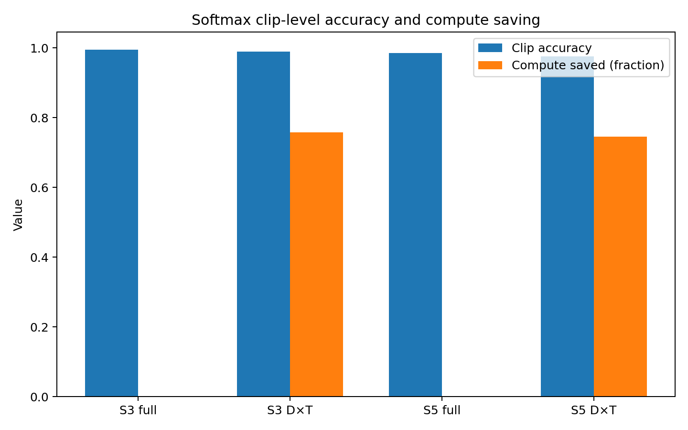
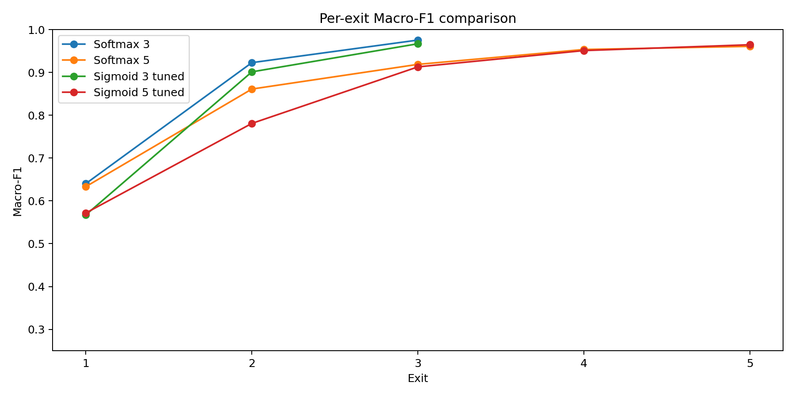

# Appendix — agentic_data_preprocessing_v0.4

This appendix contains reproducibility notes for the current **`agentic_data_preprocessing_v0.4`** branch only.

```text
Branch: agentic_data_preprocessing_v0.4
Agenda: Agentic AI-based data preprocessing plus softmax-vs-sigmoid ablation on cleaned Raw5 human-talk data
Dataset stage: raw5_agentic_cleaned
Task: five-speaker human-talk speaker classification
Models: TinyAudioCNN + ExitNet, 3-exit and 5-exit
Classes: Brene_Brown, Eckhart_Tolle, Eric_Thomas, Gary_Vee, Jay_Shetty
Final cleaned files: 3,108
```

## A1. Dataset and preprocessing commands

### A1.1 Raw5 audit

```powershell
python -m agentic_preprocessing.run_agentic_preprocessing `
  --raw_root human_talk_dataset `
  --out_dir human_talk_workspace\agent_reports `
  --classes "Brene_Brown,Eckhart_Tolle,Eric_Thomas,Gary_Vee,Jay_Shetty" `
  --expected_sample_rate 16000 `
  --expected_duration_sec 5.0
```

### A1.2 Manifest builder

```powershell
python -m agentic_preprocessing.run_manifest_builder `
  --audit_csv human_talk_workspace\agent_reports\dataset_audit_agent_report.csv `
  --triage_seed_root human_talk_triage_seed_dataset `
  --out_dir human_talk_workspace\agent_reports
```

### A1.3 Dataset builder

```powershell
python -m agentic_preprocessing.run_dataset_builder `
  --accepted_manifest human_talk_workspace\agent_reports\accepted_manifest.csv `
  --raw_root human_talk_dataset `
  --out_root human_talk_workspace\datasets\raw5_agentic_cleaned `
  --apply
```

### A1.4 Final cleaned audit

```powershell
python -m agentic_preprocessing.run_agentic_preprocessing `
  --raw_root human_talk_workspace\datasets\raw5_agentic_cleaned `
  --out_dir human_talk_workspace\agent_reports\raw5_agentic_cleaned_final_audit `
  --classes "Brene_Brown,Eckhart_Tolle,Eric_Thomas,Gary_Vee,Jay_Shetty" `
  --expected_sample_rate 16000 `
  --expected_duration_sec 5.0
```

## A2. Softmax baseline commands

### A2.1 3-exit softmax

```powershell
.\scripts\run_full.ps1 `
  -DataRoot "human_talk_workspace\datasets\raw5_agentic_cleaned" `
  -CacheRoot "human_talk_workspace\caches" `
  -Variant "raw5_agentic_cleaned_3exit_greedy_final" `
  -Policy greedy `
  -Device cpu `
  -InputMode segment `
  -Labels "Brene_Brown,Eckhart_Tolle,Eric_Thomas,Gary_Vee,Jay_Shetty" `
  -SegmentSec 1.0 `
  -HopSec 0.5 `
  -SampleRate 16000 `
  -Bandpass "50,7600" `
  -NMels 64 `
  -TapBlocks "1,3" `
  -SplitUnit file `
  -RunClipPolicy `
  -ForceRebuild
```

### A2.2 5-exit softmax

```powershell
.\scripts\run_full.ps1 `
  -DataRoot "human_talk_workspace\datasets\raw5_agentic_cleaned" `
  -CacheRoot "human_talk_workspace\caches" `
  -Variant "raw5_agentic_cleaned_5exit_greedy_final" `
  -Policy greedy `
  -Device cpu `
  -InputMode segment `
  -Labels "Brene_Brown,Eckhart_Tolle,Eric_Thomas,Gary_Vee,Jay_Shetty" `
  -SegmentSec 1.0 `
  -HopSec 0.5 `
  -SampleRate 16000 `
  -Bandpass "50,7600" `
  -NMels 64 `
  -TapBlocks "1,2,3,4" `
  -SplitUnit file `
  -RunClipPolicy `
  -ForceRebuild
```

## A3. Sigmoid one-hot ablation commands

### A3.1 Build source segment cache

```powershell
python -m scripts.prep_segments `
  --root "human_talk_workspace\datasets\raw5_agentic_cleaned" `
  --cache "human_talk_workspace\sigmoid_ablation\source_segment_cache" `
  --sr 16000 `
  --segment_sec 1.0 `
  --hop 0.5 `
  --silence_dbfs -40 `
  --config "configs\audio_moth.yaml" `
  --input_mode segment `
  --min_keep_sec 0.25 `
  --split_unit file `
  --labels Brene_Brown Eckhart_Tolle Eric_Thomas Gary_Vee Jay_Shetty `
  --bandpass 50 7600 `
  --export_segment_wavs `
  --force_rebuild
```

### A3.2 Build one-hot sigmoid manifest

```powershell
python scripts\build_sigmoid_ablation_manifest.py `
  --segments_csv "human_talk_workspace\sigmoid_ablation\source_segment_cache\segments.csv" `
  --cache_dir "human_talk_workspace\sigmoid_ablation\source_segment_cache" `
  --labels "Brene_Brown,Eckhart_Tolle,Eric_Thomas,Gary_Vee,Jay_Shetty" `
  --out_dir "human_talk_workspace\sigmoid_ablation\metadata" `
  --dataset_name "agentic_cleaned_sigmoid_ablation"
```

### A3.3 Extract sigmoid-ablation features

```powershell
python scripts\extract_multilabel_features.py `
  --manifest "human_talk_workspace\sigmoid_ablation\metadata\sigmoid_onehot_manifest.csv" `
  --labels_json "human_talk_workspace\sigmoid_ablation\metadata\labels.json" `
  --out_cache "human_talk_workspace\sigmoid_ablation\feature_cache" `
  --sample_rate 16000 `
  --clip_sec 1.0 `
  --n_mels 64 `
  --n_fft 1024 `
  --win_ms 25 `
  --hop_ms 10 `
  --cmvn
```

### A3.4 Train sigmoid 3-exit and 5-exit

```powershell
python -m training.train_multilabel `
  --manifest "human_talk_workspace\sigmoid_ablation\feature_cache\metadata\multilabel_features_manifest.csv" `
  --features_root "human_talk_workspace\sigmoid_ablation\feature_cache\features" `
  --labels_json "human_talk_workspace\sigmoid_ablation\metadata\labels.json" `
  --runs_root "human_talk_workspace\sigmoid_ablation\runs" `
  --variant "agentic_cleaned_sigmoid_ablation_3exit" `
  --tap_blocks "1,3" `
  --epochs 40 `
  --batch_size 64 `
  --lr 0.001 `
  --threshold 0.5 `
  --device cpu

python -m training.train_multilabel `
  --manifest "human_talk_workspace\sigmoid_ablation\feature_cache\metadata\multilabel_features_manifest.csv" `
  --features_root "human_talk_workspace\sigmoid_ablation\feature_cache\features" `
  --labels_json "human_talk_workspace\sigmoid_ablation\metadata\labels.json" `
  --runs_root "human_talk_workspace\sigmoid_ablation\runs" `
  --variant "agentic_cleaned_sigmoid_ablation_5exit" `
  --tap_blocks "1,2,3,4" `
  --epochs 40 `
  --batch_size 64 `
  --lr 0.001 `
  --threshold 0.5 `
  --device cpu
```

### A3.5 Threshold tuning and label-set policy

```powershell
python scripts\tune_multilabel_thresholds.py `
  --run_dir "human_talk_workspace\sigmoid_ablation\runs\agentic_cleaned_sigmoid_ablation_3exit_20260523_194423" `
  --device cpu

python scripts\tune_multilabel_thresholds.py `
  --run_dir "human_talk_workspace\sigmoid_ablation\runs\agentic_cleaned_sigmoid_ablation_5exit_20260523_202702" `
  --device cpu

python scripts\multilabel_greedy_policy.py `
  --run_dir "human_talk_workspace\sigmoid_ablation\runs\agentic_cleaned_sigmoid_ablation_3exit_20260523_194423" `
  --threshold_mode tuned_per_exit `
  --device cpu

python scripts\multilabel_greedy_policy.py `
  --run_dir "human_talk_workspace\sigmoid_ablation\runs\agentic_cleaned_sigmoid_ablation_5exit_20260523_202702" `
  --threshold_mode tuned_per_exit `
  --device cpu
```

## A4. Final tables

### A4.1 Main result table

| Setting | Model | Activation / loss | Final metric | Final Macro-F1 | Accuracy / Exact Match | Hamming loss | Policy metric | Avg exit depth | Compute saved |
| --- | --- | --- | --- | --- | --- | --- | --- | --- | --- |
| Softmax | 3-exit | Softmax + CE | single-label accuracy | 0.9756 | 0.9760 | N/A | 0.9683 | 2.0886 | 52.56% |
| Softmax | 5-exit | Softmax + CE | single-label accuracy | 0.9610 | 0.9616 | N/A | 0.9520 | 2.7144 | 62.03% |
| Sigmoid fixed | 3-exit | Sigmoid + BCE | one-hot exact match | 0.9692 | 0.9535 | 0.0121 | N/A | N/A | N/A |
| Sigmoid fixed | 5-exit | Sigmoid + BCE | one-hot exact match | 0.9627 | 0.9426 | 0.0148 | N/A | N/A | N/A |
| Sigmoid tuned | 3-exit | Sigmoid + BCE | one-hot exact match | 0.9670 | 0.9505 | 0.0131 | 0.9670 | 3.0000 | 0.00% |
| Sigmoid tuned | 5-exit | Sigmoid + BCE | one-hot exact match | 0.9647 | 0.9465 | 0.0139 | 0.9561 | 3.4537 | 30.93% |

### A4.2 Dynamic policy table

| Setting | Model | Policy | Metric | Avg exit depth | Compute saved | Exit consistency | Main observation |
| --- | --- | --- | --- | --- | --- | --- | --- |
| Softmax | 3-exit | Greedy confidence | accuracy 0.9683 | 2.0886 | 52.56% | 0.9913 | Best segment-level policy balance |
| Softmax | 5-exit | Greedy confidence | accuracy 0.9520 | 2.7144 | 62.03% | 0.9849 | Highest segment-depth compute saving |
| Sigmoid tuned | 3-exit | Label-set stability k=2 | macro-F1 0.9670 | 3.0000 | 0.00% | 1.0000 | No early exit; all samples reach final exit |
| Sigmoid tuned | 5-exit | Label-set stability k=2 | macro-F1 0.9561 | 3.4537 | 30.93% | 0.9673 | Works but less efficient than softmax |

### A4.3 Clip-level softmax table

| Model | Clip policy | Clip accuracy | Avg windows used | Avg total windows | Windows saved | Compute saved |
| --- | --- | --- | --- | --- | --- | --- |
| Softmax 3-exit | Full-window aggregation | 0.9957 | 8.6510 | 8.6510 | 0.00% | 0.00% |
| Softmax 3-exit | Depth×Time | 0.9893 | 2.0878 | 8.6510 | 75.87% | 75.82% |
| Softmax 5-exit | Full-window aggregation | 0.9850 | 8.6510 | 8.6510 | 0.00% | 0.00% |
| Softmax 5-exit | Depth×Time | 0.9764 | 2.1649 | 8.6510 | 74.98% | 74.64% |

### A4.4 Per-speaker final F1

| Speaker | Softmax 3 | Softmax 5 | Sigmoid 3 fixed | Sigmoid 3 tuned | Sigmoid 5 fixed | Sigmoid 5 tuned |
| --- | --- | --- | --- | --- | --- | --- |
| Brene_Brown | 0.9637 | 0.9427 | 0.9547 | 0.9554 | 0.9266 | 0.9396 |
| Eckhart_Tolle | 0.9924 | 0.9918 | 0.9930 | 0.9913 | 0.9918 | 0.9918 |
| Eric_Thomas | 0.9671 | 0.9520 | 0.9510 | 0.9466 | 0.9546 | 0.9513 |
| Gary_Vee | 0.9708 | 0.9513 | 0.9611 | 0.9594 | 0.9553 | 0.9518 |
| Jay_Shetty | 0.9842 | 0.9671 | 0.9860 | 0.9823 | 0.9851 | 0.9891 |

### A4.5 Best model by goal

| Goal | Best current choice | Reason |
| --- | --- | --- |
| Best final segment classification | Softmax 3-exit | Final accuracy 0.9760, Macro-F1 0.9756 |
| Best segment-level dynamic early exit | Softmax 3-exit | Accuracy 0.9683 with 52.56% compute saving |
| Highest segment-depth compute saving | Softmax 5-exit | 62.03% compute saving |
| Best clip-level accuracy | Softmax 3-exit full aggregation | Clip accuracy 0.9957 |
| Best clip-level efficiency | Softmax 3-exit Depth×Time | Clip accuracy 0.9893 with 75.82% compute saving |
| Best sigmoid final result | Sigmoid 3-exit fixed | Macro-F1 0.9692 |
| Best sigmoid tuned result | Sigmoid 5-exit tuned | Macro-F1 0.9647 |
| Future true multi-label preprocessing | TinyAudioTriageAgent | Use sigmoid/BCE for co-existing tags: target speaker, other speaker, music, silence, applause, laughter |


### Figures

Generated comparison figures are saved under `figures/human_talk/agentic_data_preprocessing_v0.4/`:









Original run plots also retained for reference: `softmax_3exit_val_acc_exits.png`, `softmax_5exit_val_acc_exits.png`, `softmax_3exit_policy_reliability.png`, and `softmax_5exit_policy_reliability.png`.


## Paper-safe conclusion

For the cleaned human-talk speaker dataset, the softmax formulation remains the most appropriate setting because each segment has one mutually exclusive speaker label. The 3-exit softmax model achieved the strongest final-exit performance and the best dynamic early-exit balance. The sigmoid/BCE ablation confirmed that the NeuroAccuExit architecture can also learn one-vs-rest speaker targets, but sigmoid is more threshold-sensitive and weaker for early-exit efficiency. Therefore, sigmoid should not replace softmax for the main speaker classifier; instead, sigmoid/BCE should be reserved for the future TinyAudioTriageAgent, where multiple audio-content tags such as target speaker, other speaker, music, silence, applause, and laughter can co-exist.

