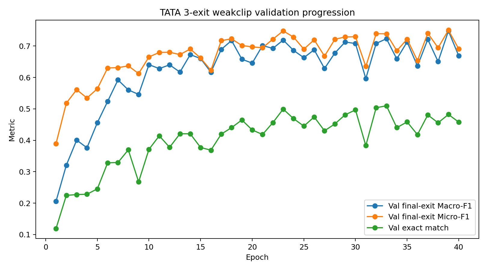
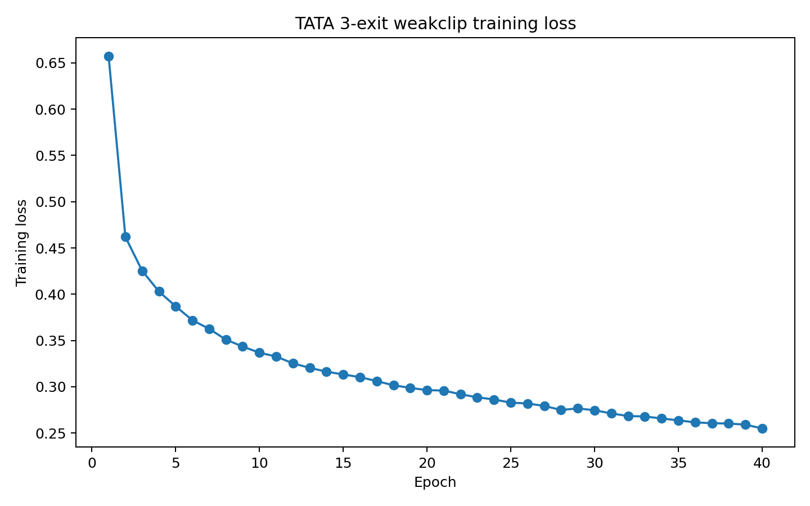
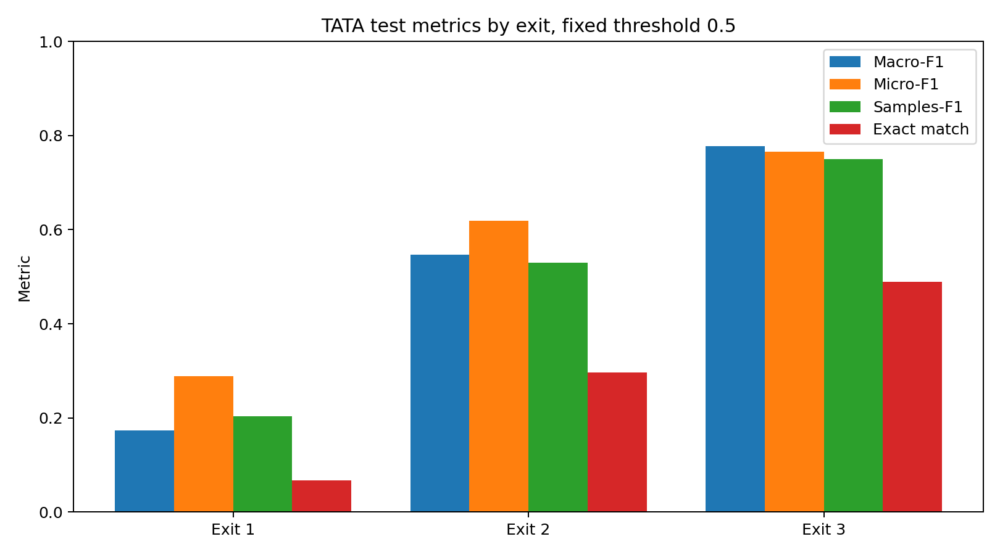
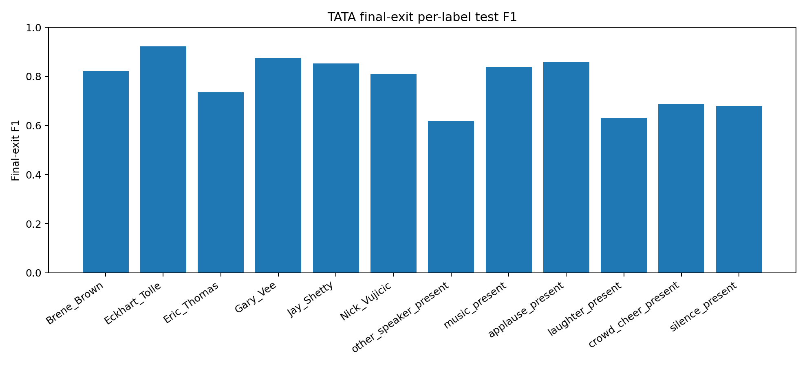
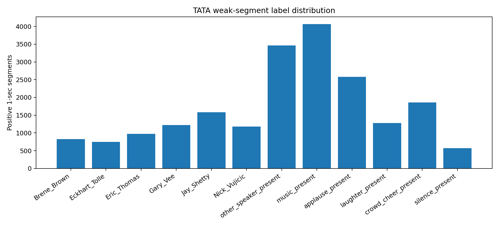
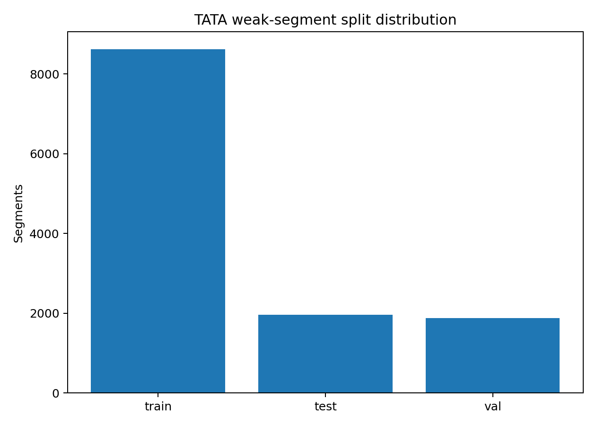

# Experiment Log — agentic_data_preprocessing_v0.5_tata_2

This log records the active **`agentic_data_preprocessing_v0.5_tata_2`** branch outcomes.

```text
Branch: agentic_data_preprocessing_v0.5_tata_2
Agenda: TinyAudioTriageAgent weak clip-level multi-label preprocessing for human-talk audio
Dataset stage: TATA reviewed 5-sec clip manifest -> weak 1-sec segment manifest
Task: multi-label detection of target speaker identity, non-target speech, and event/background audio
Model: TinyAudioCNN + ExitNet, 3-exit baseline
Labels: 12 labels = 6 target speakers + other_speaker_present + 5 event/background labels
Current status: first fixed-threshold TATA 3-exit baseline completed; threshold tuning not yet applied
```

## Branch objective

This branch builds the first practical TinyAudioTriageAgent pipeline. The aim is not to replace the v0.4 softmax speaker classifier immediately. The aim is to train a sigmoid/BCE triage model that can detect target speakers, non-target speech, and event/background labels so that raw human-talk clips can later be routed into `accepted`, `accepted_with_warning`, `needs_review`, or `rejected` groups.

## Completed chronology

| Step | Output | Status |
|---|---|---|
| Create clean branch from v0.4 | `agentic_data_preprocessing_v0.5_tata_2` | Completed |
| TATA label schema | 12 labels | Completed |
| Audio filename standardisation | Standard naming before final manifest editing | Completed |
| 5-sec clip-level manifest | Manual multi-hot labels with auto-notes | Completed |
| Training-ready manifest | 2,074 parent clips after excluding 11 rows | Completed |
| Weak 1-sec segment manifest | 12,469 segments | Completed |
| Segment-leakage check | 0 parent clips split across splits | Passed |
| Feature extraction | Log-mel `.npy` feature cache | Completed |
| TATA 3-exit fixed-threshold training | `tata_2_3exit_weakclip_20260530_121030` | Completed |
| Threshold tuning | Not applied yet | Next |
| Multi-label greedy policy | Not applied yet | After tuning |

## Label schema

| Group | Label |
| --- | --- |
| Target speaker identity | `Brene_Brown` |
| Target speaker identity | `Eckhart_Tolle` |
| Target speaker identity | `Eric_Thomas` |
| Target speaker identity | `Gary_Vee` |
| Target speaker identity | `Jay_Shetty` |
| Target speaker identity | `Nick_Vujicic` |
| Non-target speech | `other_speaker_present` |
| Event/background | `music_present` |
| Event/background | `applause_present` |
| Event/background | `laughter_present` |
| Event/background | `crowd_cheer_present` |
| Event/background | `silence_present` |

## Dataset and segment summary

| Item | Value |
| --- | --- |
| Reviewed clip-level training-ready rows | 2074 |
| Weak 1-sec segments created | 12469 |
| Segment build errors | 0 |
| Parent clips represented | 2074 |
| Parents split across train/val/test | 0 |
| Mean segments per parent clip | 6.01 |
| Min / max segments per parent clip | 2 / 109 |
| Mean active labels per segment | 1.6327 |
| Max active labels in a segment | 5 |

### Split counts

| Split | Segments |
| --- | --- |
| train | 8625 |
| test | 1961 |
| val | 1883 |

### Label-positive segment counts

| Label | Positive 1-sec segments |
| --- | --- |
| `Brene_Brown` | 825 |
| `Eckhart_Tolle` | 750 |
| `Eric_Thomas` | 975 |
| `Gary_Vee` | 1225 |
| `Jay_Shetty` | 1585 |
| `Nick_Vujicic` | 1180 |
| `other_speaker_present` | 3466 |
| `music_present` | 4065 |
| `applause_present` | 2582 |
| `laughter_present` | 1279 |
| `crowd_cheer_present` | 1857 |
| `silence_present` | 569 |

## Training configuration

| Setting | Value |
| --- | --- |
| Branch | `agentic_data_preprocessing_v0.5_tata_2` |
| Run variant | `tata_2_3exit_weakclip` |
| Run directory | `human_talk_workspace\tata_2\runs\tata_2_3exit_weakclip_20260530_121030` |
| Task | `multi_label_audio` / TinyAudioTriageAgent |
| Model | TinyAudioCNN + ExitNet |
| Exits | 3 |
| Tap blocks | `1,3` |
| Labels | 12 |
| Loss / activation | BCEWithLogitsLoss + sigmoid |
| Threshold | 0.5 |
| Loss weights | `0.3, 0.3, 1.0` |
| Exit hint | `disabled` |
| Epochs | 40 |
| Batch size | 64 |
| Learning rate | 0.001 |
| Device | `cpu` |
| Seed | 42 |
| Use positive class weighting | False |
| Runtime | 811.02 sec (~13.52 min) |

## Training outcome

| Item | Value |
|---|---:|
| Best epoch | 39 |
| Best validation final-exit Macro-F1 | 0.7478 |
| Test final-exit Macro-F1 | 0.7774 |
| Test final-exit Micro-F1 | 0.7656 |
| Test final-exit Samples-F1 | 0.7503 |
| Test final-exit exact match | 0.4895 |
| Test final-exit Hamming loss | 0.0616 |
| Runtime | 811.02 sec (~13.52 min) |

## Test metrics by exit

| Exit | Macro-F1 | Micro-F1 | Samples-F1 | Exact match | Hamming loss | Avg predicted labels | Avg true labels |
| --- | --- | --- | --- | --- | --- | --- | --- |
| 1 | 0.1730 | 0.2890 | 0.2036 | 0.0673 | 0.1219 | 0.4707 | 1.5869 |
| 2 | 0.5468 | 0.6192 | 0.5304 | 0.2968 | 0.0838 | 1.0551 | 1.5869 |
| 3 | 0.7774 | 0.7656 | 0.7503 | 0.4895 | 0.0616 | 1.5650 | 1.5869 |

## Final-exit per-label results

| Label | Precision | Recall | F1 | Support | Predicted positive |
| --- | --- | --- | --- | --- | --- |
| `Brene_Brown` | 0.7751 | 0.8733 | 0.8213 | 150 | 169 |
| `Eckhart_Tolle` | 0.9254 | 0.9185 | 0.9219 | 135 | 134 |
| `Eric_Thomas` | 0.8854 | 0.6296 | 0.7359 | 135 | 96 |
| `Gary_Vee` | 0.9804 | 0.7895 | 0.8746 | 190 | 153 |
| `Jay_Shetty` | 0.8622 | 0.8423 | 0.8521 | 260 | 254 |
| `Nick_Vujicic` | 0.8582 | 0.7667 | 0.8099 | 150 | 134 |
| `other_speaker_present` | 0.5654 | 0.6849 | 0.6195 | 511 | 619 |
| `music_present` | 0.9768 | 0.7342 | 0.8383 | 632 | 475 |
| `applause_present` | 0.9072 | 0.8151 | 0.8587 | 384 | 345 |
| `laughter_present` | 0.5609 | 0.7202 | 0.6306 | 243 | 312 |
| `crowd_cheer_present` | 0.6036 | 0.7976 | 0.6872 | 252 | 333 |
| `silence_present` | 0.8667 | 0.5571 | 0.6783 | 70 | 45 |

## Findings

| Finding | Evidence | Interpretation |
| --- | --- | --- |
| TATA baseline is working | Final exit test Macro-F1 = 0.7774 | Useful first baseline for weak clip-level multi-label training. |
| Exit quality improves with depth | Macro-F1: Exit 1 0.1730 -> Exit 3 0.7774 | Early exits are not ready yet; final exit is the reliable head. |
| No parent-clip leakage detected | Leakage parents = 0 | Segments from one 5-sec clip stay in the same split. |
| Weak-label assumption is visible | Exact match = 0.4895 | Inherited clip labels are noisy for short events; threshold tuning and future refinements are needed. |
| Fixed threshold is likely suboptimal | Some labels have high precision/low recall or low precision/high recall | Per-label threshold tuning is the next step before changing data/model. |

## Notes on warnings and audio handling

During segment building and feature extraction, some source audio files required fallback decoding through `librosa/audioread`. The run package reported **0 segment-build errors**, and feature extraction completed successfully. This means the current output is usable. Audio standardisation to clean WAV/16kHz/mono can still be introduced later to reduce warnings and improve reproducibility.

## Next strategy

| Step | Purpose | Status |
| --- | --- | --- |
| Threshold tuning | Tune per-label sigmoid thresholds and compare against fixed 0.5 | Next |
| Multi-label greedy policy | Check whether a 3-exit TATA model can exit early safely | After threshold tuning |
| Package tuned outputs | Share metrics/config/policy/log files in one ZIP | After policy |
| 5-exit TATA weakclip | Compare depth/compute tradeoff against 3-exit | Later |
| Positive class weighting / sampling | Improve weak labels such as other_speaker, laughter, crowd cheer, silence | Later ablation |
| Synthetic mixed data | Create controlled target+event/target+other-speaker mixtures | Later improvement |
| TATA inference on raw dataset | Generate pseudo-labels and routing manifests for main speaker model | After TATA is reliable |


## Figures

Generated figures for this branch are stored under `figures/human_talk/agentic_data_preprocessing_v0.5_tata_2/`:














## Paper-safe conclusion at this stage

The first TinyAudioTriageAgent experiment on `agentic_data_preprocessing_v0.5_tata_2` demonstrates that the NeuroAccuExit architecture can learn a 12-label multi-label audio triage task using BCE/sigmoid supervision and weak clip-level segment labels. The final exit achieved a fixed-threshold test Macro-F1 of **0.7774**, Micro-F1 of **0.7656**, Samples-F1 of **0.7503**, and Hamming loss of **0.0616**. This is a promising first baseline, but it is not yet an early-exit-ready TATA policy. The next required step is per-label threshold tuning, followed by multi-label greedy-policy testing.

