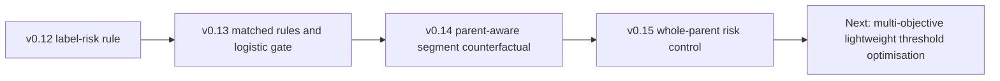

# Active Budget and Anytime Exit v0.3 — Research Record

## Scope

Branch:

```text
active_budget_anytime_exit_v0.3
```

This branch studies how a frozen three-exit multi-label audio network can decide whether deeper computation is worth executing. The branch begins from the genuine staged-inference implementation completed in v0.11 and develops four increasingly structured stopping strategies from `v0.12_EE` to `v0.15_EE`.

No checkpoint retraining was performed. The CNN and all exit heads remained frozen. Only inference-time policy logic or lightweight controller models were trained.

---

## Research context

The classifier predicts ten independent labels:

```text
Brene_Brown
Eckhart_Tolle
Eric_Thomas
Gary_Vee
Jay_Shetty
Nick_Vujicic
other_speaker_present
music_present
audience_reaction_present
silence_present
```

Because the task is multi-label, one scalar confidence can hide label-specific difficulty. Speaker identity, open-set speaker presence, music, audience reaction and silence do not stabilise at the same depth. The v0.3 experiments therefore move from global confidence rules toward label-aware and parent-aware risk estimation.

---

## Canonical model and data

| Item | Value |
|---|---|
| Model | Five-block TinyAudioCNN / ExitNet |
| Exit 1 | After Block 1 |
| Exit 2 | After Block 3 |
| Exit 3 | After Block 5 |
| Hint passing | Disabled |
| Canonical run | `main_v010_human_corrected_balanced_3exit_no_hint_20260703_201845` |
| Segment shape | `[1, 64, 101]` log-mel feature |
| Validation | 1,883 segments; 304 parents for parent protocols |
| Corrected holdout | 4,335 segments; 867 parents |
| Device | CPU |
| Segment threshold mode | `fixed_0p5` |
| Parent policy | Frozen historical LATS-v2 |

The full-depth comparator is:

```text
v0.10 no-hint + Exit 3 probabilities + frozen historical LATS-v2
```

| Macro-F1 | Micro-F1 | Samples-F1 | Exact Match | Hamming ↓ |
|---:|---:|---:|---:|---:|
| 0.862382 | 0.953131 | 0.958889 | 0.876586 | 0.013725 |

---

## Theoretical framework

Let `p_e(x)` denote the probability vector produced at exit `e`. A stopping policy uses an information state:

\[
z_e = f\left(p_1,\ldots,p_e,\text{margins},\text{stability},\text{label identity},\text{parent context}\right).
\]

The policy estimates whether the expected benefit of deeper inference exceeds its incremental cost:

\[
\text{continue if}
\quad
\widehat{\Delta Q}(z_e) > \lambda\,\Delta C_{e\rightarrow e+1}.
\]

The experiments do not observe the true future improvement at runtime. They use validation data to learn or calibrate a proxy for future harm.

### Risk signals used across versions

| Signal | Meaning |
|---|---|
| Mean binary confidence | Average `max(p, 1-p)` across labels |
| Decision margin | Distance from a label decision threshold |
| Label-set agreement | Whether consecutive exits produce the same binary label vector |
| Probability delta | Magnitude of change between exits |
| Label risk weight | Validation F1 benefit from Exit 3 relative to Exit 2 |
| Gate safe probability | Learned probability that deeper inference will not improve the sample |
| Parent counterfactual harm | Whether substituting a shallow probability changes a correct parent label into an error |
| Whole-parent risk | Whether all Exit-2 segments jointly harm the final parent prediction |

---

## Research progression



The progression intentionally preserves negative findings rather than repeatedly tuning one method on the holdout.

---

# v0.12_EE — Validation-Derived Label-Aware Policy

## Research question

Can labels that gain more from Exit 3 be assigned larger continuation risk so that samples involving those labels are less likely to terminate at Exit 2?

## Modification

v0.12 extends the global Exit-2 policy with a label-specific risk profile:

\[
r_l = \frac{\max(0, F1_{3,l}-F1_{2,l})}{\max_j \max(0,F1_{3,j}-F1_{2,j})}.
\]

The researchers selected the formula and search procedure; the validation data determined the label ranking.

The highest validation risk weights were:

| Label | Risk weight |
|---|---:|
| `other_speaker_present` | 1.0000 |
| `Eric_Thomas` | 0.7504 |
| `Brene_Brown` | 0.6853 |
| `Nick_Vujicic` | 0.5753 |
| `Jay_Shetty` | 0.5056 |

## Frozen settings

| Setting | Value |
|---|---:|
| Confidence grid | 0.55, 0.65, 0.75, 0.85, 0.95 |
| Global margin grid | 0.00, 0.02, 0.05 |
| Probability-delta grid | 0.05, 0.10, 0.20, 1.00 |
| Label-risk grid | 0.10, 0.25, 0.50, 0.75, 1.00 |
| Minimum label improvement | 0.02 |
| Maximum validation Macro-F1 drop | 0.01 |
| Minimum validation Exit-2 rate | 0.02 |
| Selected confidence | 0.55 |
| Selected margin | 0.00 |
| Selected max delta | 1.00 |
| Selected label-risk threshold | 0.50 |
| Exit 1–Exit 2 agreement | Required |

## Confirmed results

Validation:

| Exit-2 rate | FLOPs saved | Parent Macro-F1 | Macro-F1 drop | Status |
|---:|---:|---:|---:|---|
| 22.73% | 14.61% | 0.894195 | 0.008422 | Constraint met |

Corrected holdout:

| Exit-2 rate | FLOPs saved | Macro-F1 | Micro-F1 | Samples-F1 | Exact | Hamming ↓ |
|---:|---:|---:|---:|---:|---:|---:|
| 11.19% | 7.19% | 0.843703 | 0.936689 | 0.944692 | 0.840830 | 0.018570 |

## Finding

The policy demonstrated genuine label-aware compute skipping, but the quality loss remained too large for the preferred final operating point. Coverage also dropped substantially from validation to holdout.

---

# v0.13_EE — Matched Strategy Comparison

## Research questions

1. Do label-aware rules outperform carefully tuned global rules?
2. Does a lightweight logistic gate provide a better quality–compute Pareto point?
3. Which method remains strongest when every strategy uses the same validation constraint?

## Modification

v0.13 compares five policies:

- global confidence + margin;
- global confidence + margin + probability delta;
- validation-derived label risk;
- direct per-label margin thresholds;
- logistic-regression stopping gate.

Validation parents are divided 70/30:

- derivation subset: risk profiles, per-label margins and gate training;
- selection subset: matched policy selection.

## Confirmed holdout results

| Strategy | Exit-2 rate | FLOPs saved | Parent Macro-F1 | Parent Micro-F1 | Exact | Hamming ↓ |
|---|---:|---:|---:|---:|---:|---:|
| Global confidence + margin | 1.18% | 0.76% | 0.861433 | 0.952719 | 0.875433 | 0.013841 |
| Global + delta | 2.42% | 1.56% | 0.858556 | 0.950845 | 0.869666 | 0.014418 |
| Label risk | 2.42% | 1.56% | 0.858556 | 0.950845 | 0.869666 | 0.014418 |
| **Per-label margin** | **2.24%** | **1.44%** | **0.858748** | **0.951556** | **0.874279** | **0.014187** |
| Logistic gate | 17.58% | 11.30% | 0.833034 | 0.943529 | 0.855825 | 0.016609 |

## Key ablations

- The selected label-risk policy and global delta policy made exactly the same holdout decisions. The risk condition was non-binding.
- The logistic gate learned a meaningful ranking but the validation-selected `P(safe) >= 0.75` threshold was too aggressive on holdout.
- The per-label margin policy retained better Exact Match and Hamming than the global-delta and label-risk rules while saving nearly the same FLOPs.

## Finding

The v0.13 per-label margin policy is the current adaptive recommendation. It does not save large computation, but it is the most defensible quality–compute point among completed v0.3 policies.

---

# v0.14_EE — Parent-Aware Adaptive Gate

## Research questions

1. Can a gate predict parent-level harm rather than segment-level error improvement?
2. Can separate label-specific unsafe thresholds improve safety?
3. Is Exit 1 useful enough to justify a future hierarchical controller?

## Modification

For each segment, v0.14 creates a counterfactual parent prediction:

```text
all other parent segments use Exit 3
one candidate segment uses Exit 1 or Exit 2
```

One unsafe-probability model is trained per label using five parent-grouped OOF folds. A candidate must satisfy both average quality and a one-sided cross-fold Macro-F1-drop confidence bound.

## Validation outcome

| Strategy | Source rate | FLOPs saved | Macro-F1 drop | Drop upper confidence | Robust constraint |
|---|---:|---:|---:|---:|---|
| Exit 2→3 gate | 37.92% | 24.37% | 0.011629 | 0.012846 | Failed |
| Exit 1→3 ablation | 11.58% | 11.16% | 0.018751 | 0.038275 | Failed |

Both evaluated policies were explicitly marked `fallback_best_robust_quality`.

## Holdout outcome

| Strategy | Source rate | FLOPs saved | Parent Macro-F1 | Parent Micro-F1 | Exact | Hamming ↓ | Measured speedup |
|---|---:|---:|---:|---:|---:|---:|---:|
| Exit 2→3 gate | 20.30% | 13.05% | 0.840798 | 0.933966 | 0.835063 | 0.019262 | 0.9858× |
| Exit 1→3 ablation | 0.72% | 0.69% | 0.861442 | 0.952756 | 0.876586 | 0.013841 | 0.9582× |

## Finding

The primary Exit-2 gate failed quality and robust-validation requirements. Exit 1 preserved quality for a tiny subset but produced no practical speed benefit. The individual-segment counterfactual target also failed to model interactions when several segments from one parent stopped together.

---

# v0.15_EE — Whole-Parent Selective Risk Control

## Research questions

1. Does one joint decision for the complete parent eliminate the multi-segment interaction mismatch?
2. Can risk-controlled selection preserve both Macro-F1 and Micro-F1?
3. Can a transparent empirical controller or shared logistic controller certify useful coverage?

## Modification

All parent segments execute to Exit 2. Exit-1 and Exit-2 probabilities are aggregated using frozen LATS-v2. The complete parent either stops at Exit 2 or all segments continue to Exit 3.

Controllers:

- nonparametric empirical risk calibrator;
- one shared class-balanced logistic model across parent-label pairs.

Default validation constraints:

| Constraint | Limit |
|---|---:|
| Parent Macro-F1 drop | 0.005 |
| Parent Micro-F1 drop | 0.005 |
| Parent Exact Match drop | 0.01 |
| Overall harmful-stop fraction | 0.01 |
| Minimum parent stop rate | 0.02 |
| OOF folds | 5 |

## Validation outcome

| Controller | Parent stop rate | FLOPs saved | Macro drop | Micro drop | Harm | Harm upper bound | Deployment eligible |
|---|---:|---:|---:|---:|---:|---:|---|
| Nonparametric | 1.97% | 0.99% | 0 | 0 | 0 | 0.008823 | No |
| Shared logistic | 0.00% | 0.00% | 0 | 0 | 0 | 0.008823 | No |

The nonparametric controller missed the predefined 2% minimum coverage by one validation parent. The criterion was not changed after observing this result.

## Holdout outcome

| Controller | Parent stop rate | FLOPs saved | Parent Macro-F1 | Parent Micro-F1 | Exact | Hamming ↓ | Speedup |
|---|---:|---:|---:|---:|---:|---:|---:|
| Nonparametric | 0.69% | 0.44% | 0.863129 | 0.952681 | 0.875433 | 0.013841 | 0.9338× |
| Shared logistic | 0.00% | 0.00% | 0.862382 | 0.953131 | 0.876586 | 0.013725 | 0.9235× |

## Finding

The whole-parent formulation fixed the theoretical mismatch and preserved quality, but the reduced number of parent-level examples produced conservative policies. Neither controller saved meaningful computation or latency, and both were marked non-deployable.

---

## Cross-version interpretation

### Confirmed

- Staged inference and checkpoint equivalence are correct.
- v0.12–v0.15 all used frozen validation-selected policies with no holdout retuning.
- v0.13 per-label margin is the best current adaptive quality–compute point.
- v0.14 and v0.15 did not produce a deployment-eligible learned controller.
- Actual CPU speed depends on controller overhead, grouping and batching, not FLOPs alone.

### Interpretation

- The limited gain is not necessarily caused by insufficient CNN depth; it is primarily a stopping-policy and calibration problem.
- Label-specific rules are useful, but learned gates need more data or stronger regularisation to transfer safely.
- Parent-level control aligns with final evaluation but reduces the effective sample size from 1,883 segments to 304 validation parents.

### Future work — not implemented here

The strongest next direction is multi-objective optimisation of a lightweight per-label rule:

```text
maximise estimated and measured compute saving
subject to Macro-F1, Micro-F1, Exact Match and Hamming constraints
```

Bayesian or evolutionary optimisation can search continuous per-label margins and stability thresholds while retaining a low-overhead runtime policy. This belongs to the next branch, not v0.3.

---

## What must not be overclaimed

- v0.3 did not find a globally optimal policy.
- v0.3 did not complete explicit budget-aware or anytime inference.
- Estimated FLOP saving is not equivalent to real speedup.
- The v0.13 logistic `0.75` operating point is not safe enough to recommend.
- The v0.15 Macro-F1 increase does not mean the parent policy is globally better.
- The corrected holdout must not be used for future threshold selection.
- The historical frozen LATS-v2 result is a corrected-holdout evaluation, not an independent external-test result.
