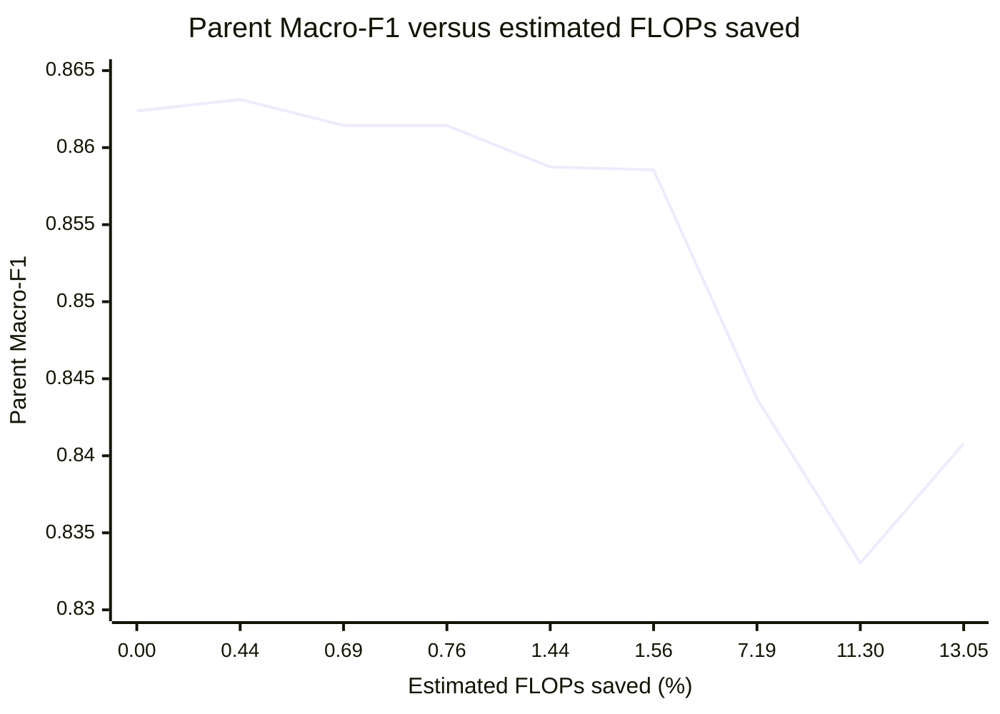

# Cumulative Results — v0.12_EE to v0.15_EE

## Reporting convention

All parent metrics use the frozen historical LATS-v2 configuration. The corrected holdout contains 867 parents and 4,335 segments. Higher F1/Exact Match is better; lower Hamming Loss is better.

## Headline comparison

| Method | Decision unit | Stop rate | Avg depth | FLOPs saved | Macro-F1 | Micro-F1 | Samples-F1 | Exact | Hamming ↓ | Validation/deployment status |
|---|---|---:|---:|---:|---:|---:|---:|---:|---:|---|
| Always Exit 3 | None | 0.00% | 3.0000 | 0.00% | **0.862382** | **0.953131** | **0.958889** | **0.876586** | **0.013725** | Canonical reference |
| v0.12 label risk | Segment | 11.19% | 2.8881 | 7.19% | 0.843703 | 0.936689 | 0.944692 | 0.840830 | 0.018570 | Validation constraint met; holdout quality loss high |
| v0.13 global confidence + margin | Segment | 1.18% | 2.9882 | 0.76% | 0.861433 | 0.952719 | 0.958505 | 0.875433 | 0.013841 | Conservative valid rule |
| v0.13 global confidence + margin + delta | Segment | 2.42% | 2.9758 | 1.56% | 0.858556 | 0.950845 | 0.956736 | 0.869666 | 0.014418 | Matched rule ablation |
| v0.13 label risk | Segment | 2.42% | 2.9758 | 1.56% | 0.858556 | 0.950845 | 0.956736 | 0.869666 | 0.014418 | Risk condition non-binding |
| **v0.13 per-label margin** | Segment | **2.24%** | **2.9776** | **1.44%** | **0.858748** | **0.951556** | **0.957198** | **0.874279** | **0.014187** | **Current adaptive recommendation** |
| v0.13 logistic gate | Segment | 17.58% | 2.8242 | 11.30% | 0.833034 | 0.943529 | 0.949750 | 0.855825 | 0.016609 | Validation-selected but unsafe holdout trade-off |
| v0.14 Exit 2→3 parent-aware gate | Segment | 20.30% | 2.7970 | 13.05% | 0.840798 | 0.933966 | 0.942473 | 0.835063 | 0.019262 | Robust validation failed |
| v0.14 Exit 1→3 ablation | Segment | 0.72% | 2.9857 | 0.69% | 0.861442 | 0.952756 | 0.958697 | **0.876586** | 0.013841 | Robust validation failed; quality near baseline |
| v0.15 nonparametric parent risk | Parent | 0.69% | 2.9931 | 0.44% | 0.863129 | 0.952681 | 0.958505 | 0.875433 | 0.013841 | Not deployment-eligible |
| v0.15 shared logistic parent gate | Parent | 0.00% | 3.0000 | 0.00% | 0.862382 | 0.953131 | 0.958889 | 0.876586 | 0.013725 | Not deployment-eligible; no stops |

## Quality change relative to Always Exit 3

| Method | Δ Macro-F1 | Δ Micro-F1 | Δ Samples-F1 | Δ Exact | Δ Hamming |
|---|---:|---:|---:|---:|---:|
| v0.12 label risk | -0.018678 | -0.016442 | -0.014198 | -0.035755 | +0.004844 |
| v0.13 global confidence + margin | -0.000949 | -0.000412 | -0.000384 | -0.001153 | +0.000115 |
| v0.13 global + delta | -0.003826 | -0.002286 | -0.002153 | -0.006920 | +0.000692 |
| v0.13 per-label margin | -0.003634 | -0.001575 | -0.001691 | -0.002307 | +0.000462 |
| v0.13 logistic gate | -0.029348 | -0.009602 | -0.009139 | -0.020761 | +0.002884 |
| v0.14 Exit 2→3 gate | -0.021584 | -0.019165 | -0.016416 | -0.041522 | +0.005537 |
| v0.14 Exit 1→3 | -0.000940 | -0.000375 | -0.000192 | 0.000000 | +0.000115 |
| v0.15 nonparametric | +0.000747 | -0.000450 | -0.000384 | -0.001153 | +0.000115 |
| v0.15 shared logistic | 0.000000 | 0.000000 | 0.000000 | 0.000000 | 0.000000 |

The v0.15 nonparametric Macro-F1 increase is not a general quality win because Micro-F1 and Exact Match decreased.

## Quality–compute figure

The table is authoritative; the following Mermaid chart visualises Parent Macro-F1 against estimated FLOPs saved for selected methods.

## Version-level ablation summary

### v0.12 versus v0.11

v0.12 added validation-derived label risk and reduced early stopping from 508 to 485 holdout segments. Compared with the v0.11 global policy, it improved all parent quality metrics slightly while reducing estimated savings from 7.53% to 7.19%. It remained too aggressive for the preferred quality target.

### v0.13 matched policies

- Per-label margin was the best balanced rule.
- Global confidence + margin preserved quality most closely but saved only 0.76% FLOPs.
- Label risk was identical to global delta, showing no marginal decision value in the selected configuration.
- Logistic gating increased coverage and estimated savings but substantially harmed Parent Macro-F1 and Exact Match.

### v0.14 parent-aware gates

No candidate satisfied the robust validation constraint. Exit-2 stopping produced large theoretical savings but damaged all main holdout metrics. Exit-1 stopping preserved quality but was too rare and slower than full depth.

### v0.15 whole-parent control

The whole-parent decision removed the v0.14 joint-substitution mismatch. The nonparametric controller preserved metrics but stopped only six holdout parents. The shared logistic controller stopped none. Both were slower because policy overhead exceeded saved backbone computation.

## Measured latency caution

| Version | Timing status | Interpretation |
|---|---|---|
| v0.12 | Model-only single run | Not a controlled speedup comparison |
| v0.13 | Same script but unstable common-stage timing | Preliminary only; do not use as final acceleration claim |
| v0.14 | 30 repeats, one CPU thread, median/IQR | Controllers were slower than Always Exit 3 |
| v0.15 | 30 repeats, one CPU thread, median/IQR | Controllers were slower than Always Exit 3 |

Publication-quality speed claims require repeated end-to-end profiling on the intended deployment hardware and batch regime.

## Final branch decision

| Role | Method |
|---|---|
| Full-quality comparator | Always Exit 3 + frozen LATS-v2 |
| Current adaptive baseline | v0.13 per-label margin |
| Negative learned-gate ablation | v0.14 Exit 2→3 |
| Parent-risk diagnostic | v0.15 nonparametric/shared logistic |
| Next optimisation target | Multi-objective search over low-overhead per-label rules |
