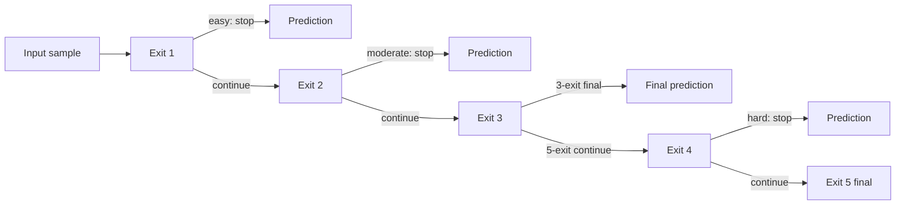
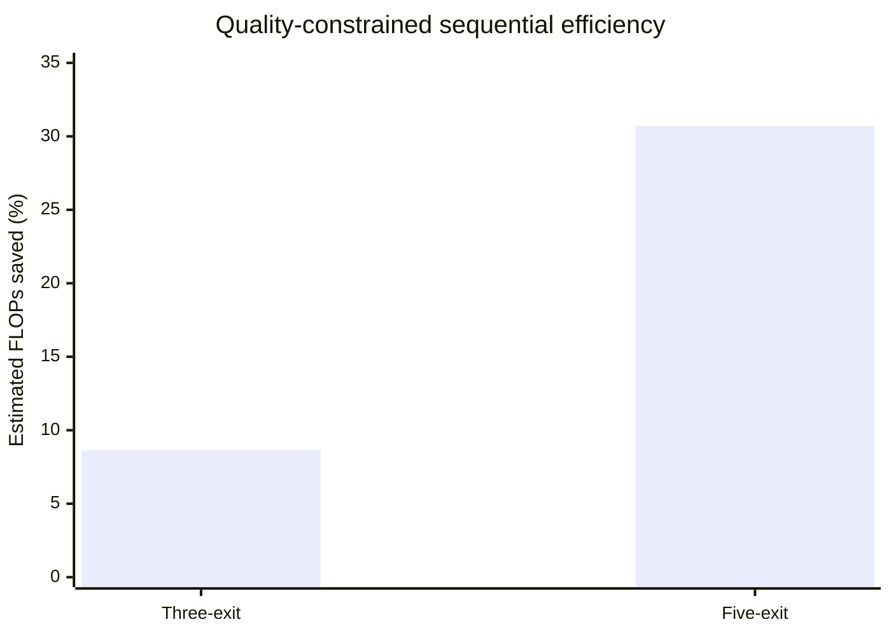
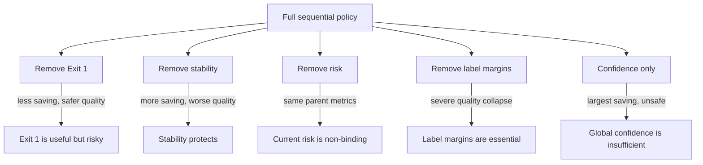
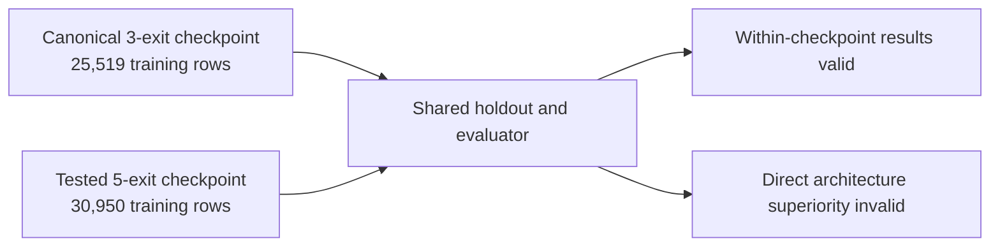

# v0.17_EE Figures

These repository-rendered Mermaid figures summarise the confirmed v0.17 results. Exact values remain in the CSV and JSON records.

## Sequential routes

## Exit distribution

```mermaid
xychart-beta
    title "v0.17 holdout exit distribution (%)"
    x-axis [E1, E2, E3, E4, E5]
    y-axis "Percent" 0 --> 100
    bar [6.07, 4.34, 89.60, 0, 0]
    bar [6.83, 1.22, 18.59, 26.30, 47.06]
```

First bar series: 3-exit policy. Second bar series: 5-exit policy.

## Estimated saving and measured speedup

| Architecture | Estimated FLOPs saved | Measured speedup | Holdout limits |
|---|---:|---:|---|
| 3-exit | 8.64% | 1.037× | Failed |
| 5-exit | 30.71% | 1.114× | Passed |

## Ablation interpretation map

## Fairness warning

