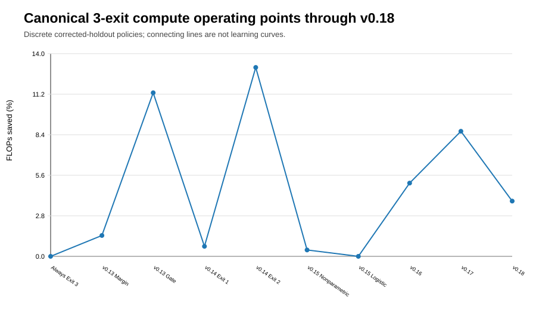
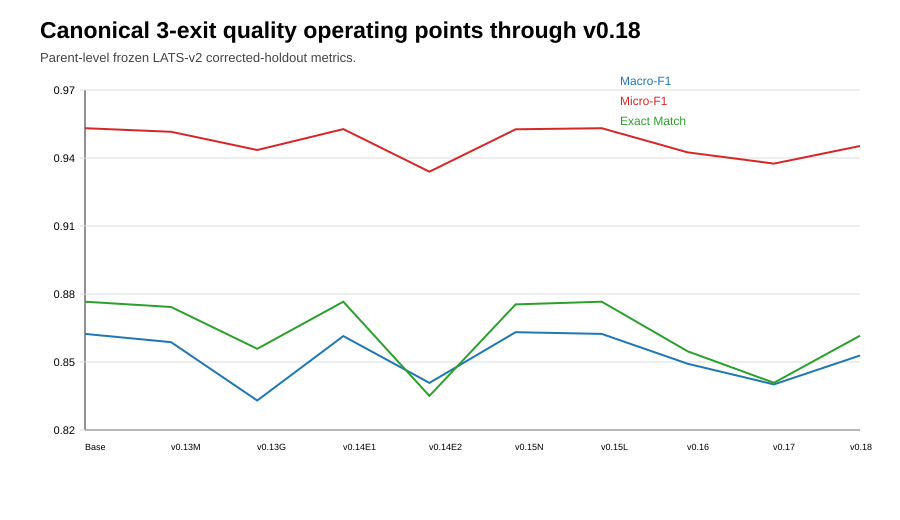
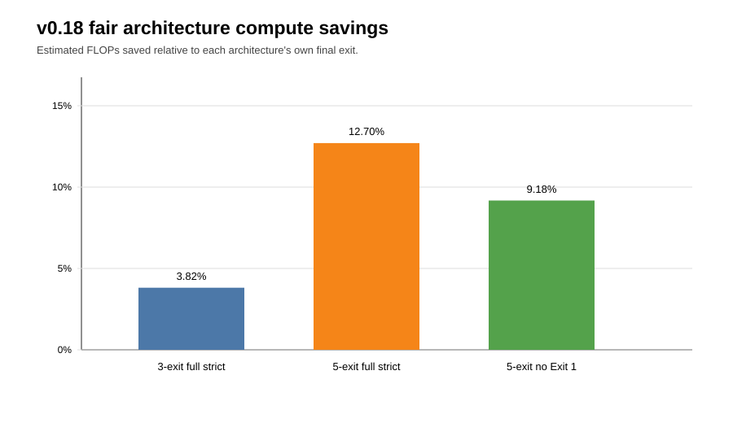
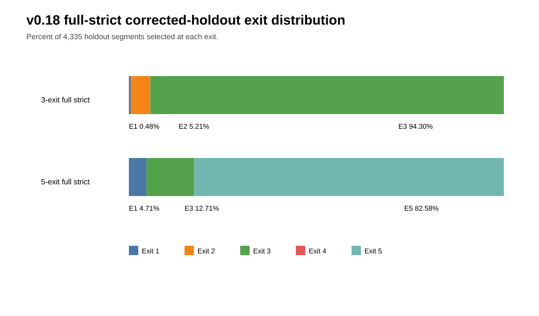
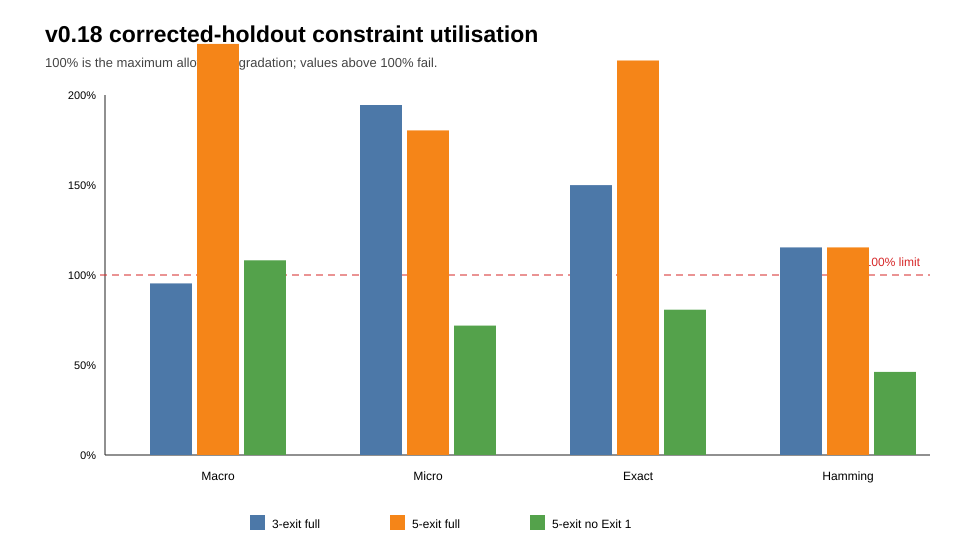
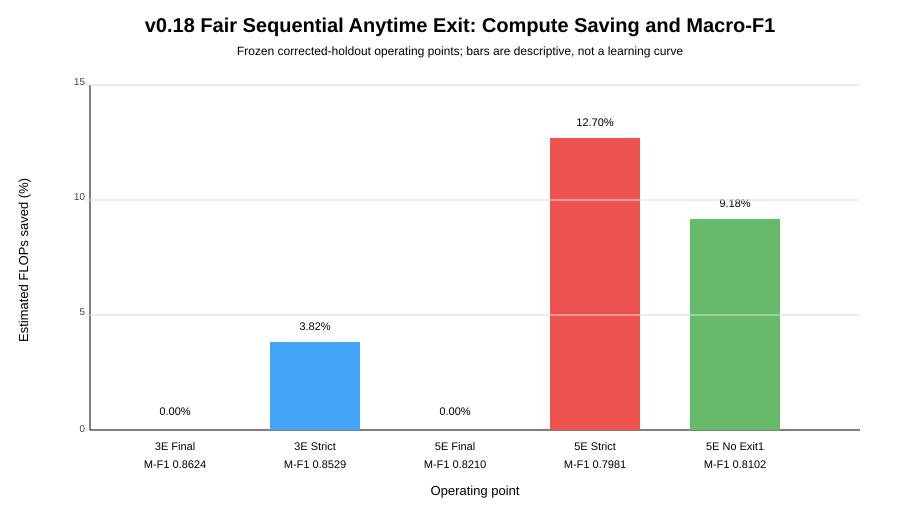

# v0.18_EE Figures

## Canonical cross-version FLOP saving

Discrete corrected-holdout operating points; not a learning curve or continuous Pareto frontier.

## Canonical cross-version quality

Macro-F1, Micro-F1, and Exact Match for the canonical 3-exit family.

## Fair architecture FLOP comparison

Each policy is compared with its architecture-specific final exit.

## Full-strict exit distribution

The selected fair five-exit holdout policy uses Exits 1, 3, and 5; Exit 2 and Exit 4 have zero coverage.

## Holdout constraint utilisation

100% marks the maximum allowed degradation. Values above 100% fail the corresponding constraint.

## Existing summary figure

## Figure cautions

- Lines connect discrete operating points and do not represent training trajectories.
- FLOP estimates are architecture-based, not measured latency.
- Speedups are CPU-, batch-, threading-, and implementation-specific.
- v0.17 non-fair and v0.18 fair five-exit figures answer different questions.
